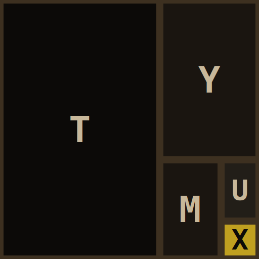

<p align="center">
  
</p>

<h1 align="center">tymux</h1>
<p align="center"><strong>tmux's model, rebuilt with a typed API.</strong></p>

A tmux-inspired terminal multiplexer, rebuilt from scratch in Rust with a
first-class gRPC/protobuf API. tmux's session/window/pane model is the
starting point; the reason to rebuild it rather than script around tmux is
the API — the multiplexer's core state (what's on screen, structured, not
scraped) is meant to be driven by things other than a human at a terminal:
AI coding agents, web frontends (e.g. [stapler-squad](https://github.com/tstapler/stapler-squad)),
scripts in any language buf can generate a client for.

- **Structured pane capture** — `CapturePane`/`Attach` return cells with
  attributes, not raw ANSI text you have to re-parse
- **One proto schema, buf-managed** — add a TS/Python/Go client without
  touching the Rust core; [`clients/ts/`](clients/ts/README.md) is a real,
  working TypeScript client proving this, not an aspirational claim
- **Built PTY-up for programmatic control** — not a human-scripting tool
  with an API bolted on afterward

## Why not just script tmux?

tmux's own scripting surface (`capture-pane`, control mode) hands you text —
ANSI escapes included — that a caller has to re-parse to know what's
actually on screen. `tymux`'s `CapturePane` and `Attach` RPCs return a
structured grid of cells with attributes directly (see
`proto/tymux/v1/tymux.proto`), backed by a real terminal-state parser
([`vt100`](https://docs.rs/vt100)) inside the daemon. That structured model
is the actual point of this project.

## Layout

```
crates/
  tymux-core/   session/window/pane engine — PTY spawn (portable-pty), vt100
                screen state, binary split-tree layout, Tier-0 persistence
  tymux-proto/  generated Rust types from proto/ (tonic-build via build.rs)
  tymuxd/       the daemon: gRPC server wrapping tymux-core
  tymux-cli/    client: create/list/attach/split/kill sessions, config +
                keybindings, copy-mode, status bar
proto/          buf-managed .proto — lint/breaking-change checks, and the
                source of truth for every non-Rust client (buf.gen.yaml)
clients/ts/     working TypeScript client generated from proto/ (see its
                own README for scope/setup)
```

Rust's own codegen goes through `tonic-build` directly against
`proto/tymux/v1/tymux.proto` (the idiomatic path for a Rust service) — buf
manages proto hygiene (`buf lint`, `buf breaking`) and generates
`clients/ts/gen/` via `proto/buf.gen.yaml`.

## Status

v1.0: sessions have multiple windows, and windows split into panes (binary
splits nest arbitrarily — `tymux split myproject:0.0 --vertical`; see
`docs/adr/0001-single-pane-per-session-for-now.md`, superseded by Epic 3).
Config and keybindings live in `$XDG_CONFIG_HOME/tymux/config.toml` (tmux-
parity defaults, e.g. `C-b d` to detach, `C-b %`/`C-b "` to split — see
`crates/tymux-cli/src/config.rs`'s `BINDABLE_ACTIONS`). Copy-mode
(`C-b [`) scrolls and searches a pane's retained scrollback. A status bar
shows the active window/pane and, when the prefix key is armed, a hint
line of available bindings; `--no-status-bar` disables it entirely for a
pure passthrough with zero added escape bytes, and `NO_COLOR` is
respected.

**Persistence is Tier-0 only**: session/window/pane *structure* (names,
layout tree, working directories, the command each pane was running)
survives a `tymuxd` restart, written to
`$XDG_STATE_HOME/tymux/sessions/`. Scrollback *content* does not persist
— a restarted daemon restores each session as dead-but-reviveable
(`tymux revive <session>` respawns fresh panes in the persisted layout,
re-running each pane's original command in its original cwd); it does not
replay what was on screen before the restart.

**No auth** — the daemon is meant to run locally for now (loopback-trust
model); it warns loudly at startup if `TYMUXD_ADDR` is set to a
non-loopback address, since there's no per-pane authorization yet.

**Cross-language clients**: [`clients/ts/`](clients/ts/README.md) is a
real, working Node.js TypeScript client proving `CreateSession`, `Attach`,
and `CapturePane` all work from outside Rust (ADR-003). Browser support
for live `Attach` sessions is a known, documented limitation, not yet
solved — see that README for why.

See `docs/reviews/is-it-ready-2026-07-13.md` for the pre-v1.0 readiness
review this status section originally drew from.

## Known Limitations

- **Scrollback content does not survive a daemon restart** — only
  session/window/pane structure does (Tier-0 persistence above). A richer
  scrollback-persistence tier was considered and explicitly ruled out for
  v1.0.
- **Loopback-only trust model** — no authentication/authorization; do not
  bind `tymuxd` to a non-loopback address without understanding the
  daemon then has zero access control.
- **Binary splits only** — a window's pane arrangement is a strictly
  binary tree (nested splits express any N-pane layout, but there is no
  single N-ary "even-horizontal" layout primitive like tmux's).
- **No browser `Attach`** — see Cross-language clients above.
- **No dedicated screen-reader navigation for multi-pane windows** —
  v1.0 is fully keyboard-operable (no mouse dependency) and respects
  `NO_COLOR`, but a screen-reader user with multiple panes/windows has no
  non-visual navigation aid beyond the plain keyboard bindings.

## Accessibility

v1.0 supports fully keyboard-only operation (every action — split,
switch window, copy-mode, detach — is a keybinding, never mouse-only);
`NO_COLOR` is respected for color-free output; `--no-status-bar` gives a
pure-passthrough mode with zero added chrome bytes. Out of scope for
v1.0: screen-reader-aware navigation between panes/windows (see Known
Limitations above).

## Running it

```sh
cargo run -p tymuxd &          # starts the daemon on 127.0.0.1:7419
cargo run -p tymux-cli -- new  # creates a session and attaches
```

`Ctrl-d` (or exiting the shell) ends the pane; the daemon keeps running
for the next session.

## Dev setup

- [buf](https://buf.build/docs/installation) — `buf lint proto` before
  committing a proto change
- `cargo fmt` / `cargo clippy --workspace --all-targets` — enforced in CI
  (`.github/workflows/ci.yml`)
- **End-to-end tests** (`crates/tymux-e2e`): spawns the real `tymuxd`/`tymux`
  binaries under a genuine pseudo-tty (`portable-pty` + `vt100`, the same
  machinery `tymux-core::Pane` uses) and asserts on rendered screen content
  instead of raw ANSI bytes. Includes `insta`-based golden-snapshot tests
  (`cargo insta review` to accept an intentional rendering change). Run with
  `cargo build --workspace && cargo test -p tymux-e2e` — the binaries must
  already be built since this crate resolves them by path rather than via
  `CARGO_BIN_EXE_*` (neither `tymuxd` nor `tymux-cli` has a `[lib]` target,
  so Cargo won't set that env var across crates).
- **Releasing**: bump `[workspace.package] version` in `Cargo.toml`, then
  push a matching `vX.Y.Z` tag. CI's `tag-version-check` job fails the
  build if the tag and workspace version ever drift.

