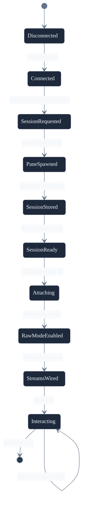
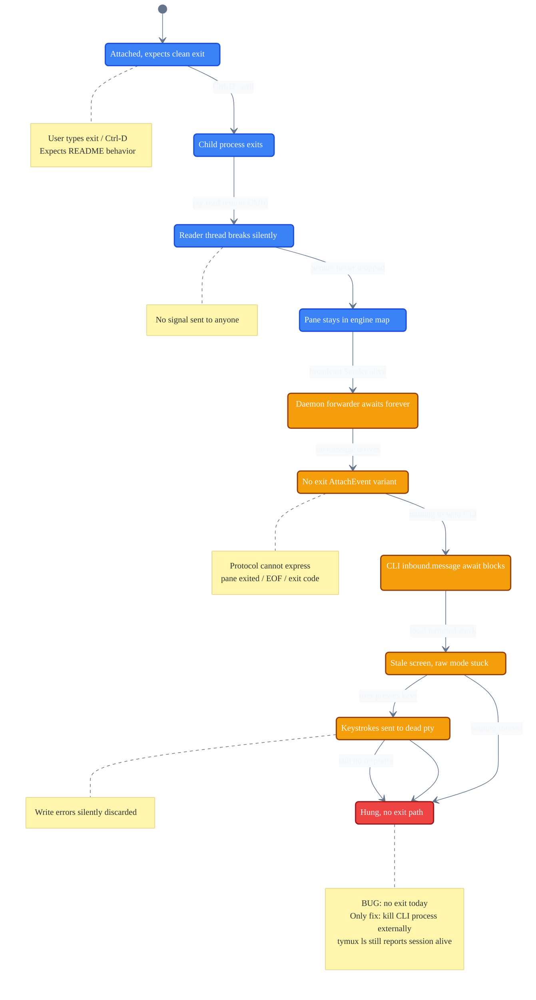
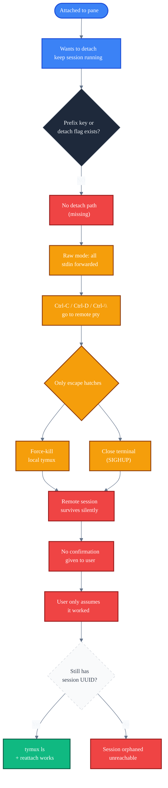
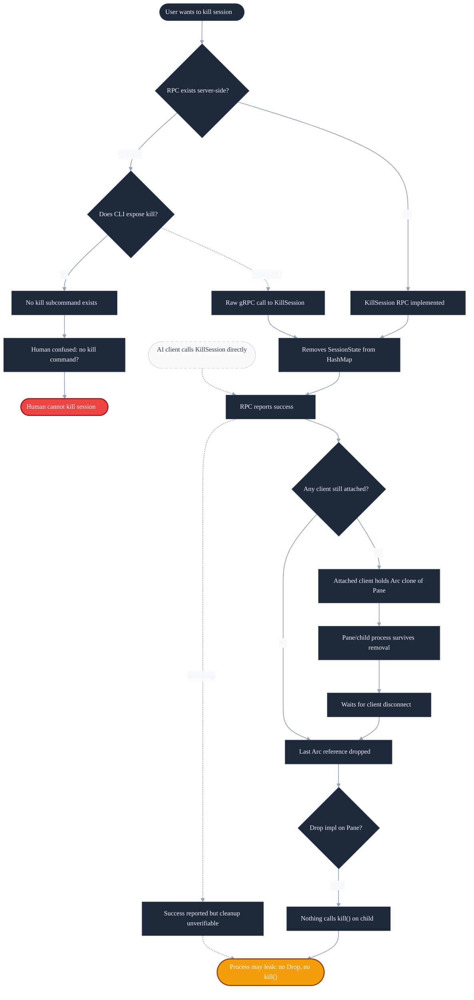
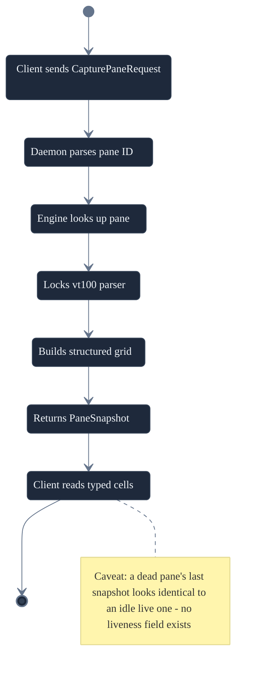
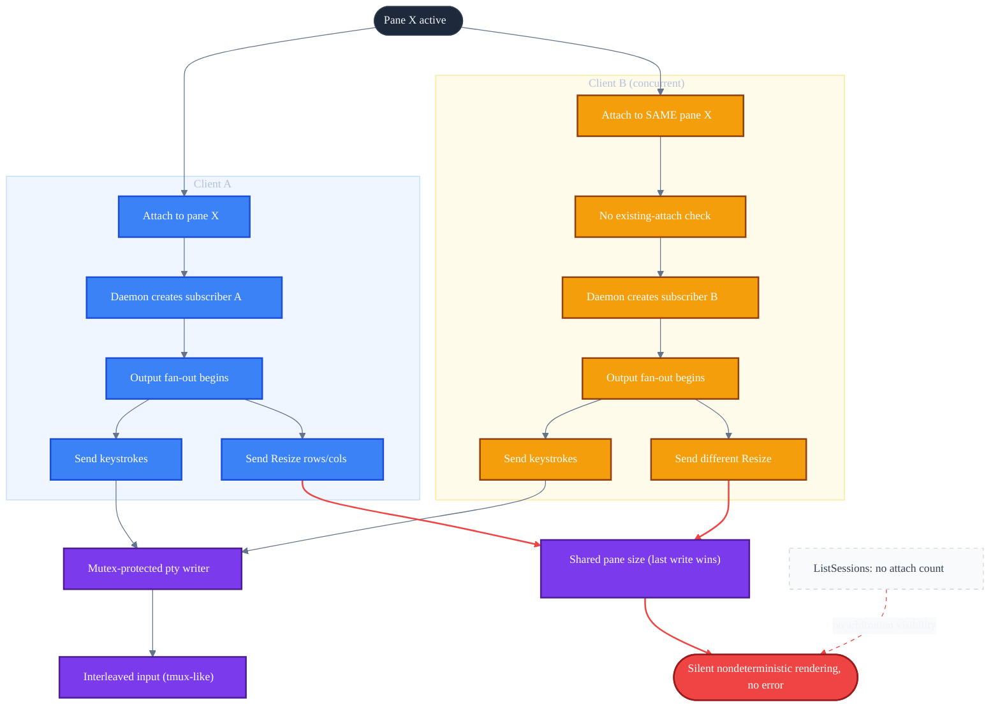

# User Journey Map — tymux
> Generated 2026-07-13. Focus: whole app.
>
> Grounded entirely in the current code (`crates/tymux-cli`, `crates/tymuxd`,
> `crates/tymux-core`, `proto/tymux/v1/tymux.proto`), not the README's
> aspirational framing. tymux is pre-alpha: one session = one window = one
> pane, no auth, no persistence.

## User Types

| Type | Description | Primary activities |
|---|---|---|
| Interactive terminal user | A human running `tymux` at a shell, porting tmux muscle memory | Create/list/attach sessions, interact with a live shell |
| AI coding agent / programmatic client | A script or agent driving tymux over gRPC directly | CapturePane (structured reads), CreateSession, scripted Attach |
| Future web frontend (e.g. stapler-squad) | A web app embedding tymux sessions | Same gRPC surface as an AI agent — no dedicated affordances yet |

## Story Map Backbone

| Activity | Users | Key tasks |
|---|---|---|
| Manage sessions | Interactive user, AI agent | `tymux new`, `tymux ls`, `CreateSession`, `ListSessions`; `KillSession` exists server-side only |
| Attach to and interact with a pane | Interactive user, AI agent | `tymux attach <id>`, send input, receive output over the bidi `Attach` stream; ending = only via shell exit |
| Read pane state structurally (no attach) | AI agent, future web frontend | `CapturePane` → structured cell grid + cursor position, no ANSI parsing |
| Resize a pane | AI agent (works); interactive user (not wired up) | `Resize` message over `Attach`; CLI never sends one on local terminal resize |
| Build/generate a client | AI agent, web frontend, script authors | `buf generate` against `tymux.proto`; `buf lint`/`buf breaking`; connect with no auth |
| Run and operate the daemon | Local operator | `cargo run -p tymuxd`, `TYMUXD_ADDR`, kill = ends every session (no persistence) |

## Journeys

### 1. First session create + attach (human CLI)
**Trigger**: user runs `tymux new`
**Emotional tone**: routine/confident — matches tmux muscle memory, until something goes wrong
**Steps**:
1. CLI connects to the daemon and sends `CreateSessionRequest`
2. Daemon spawns a pane at a **hardcoded 24×80** — the proto has no size field, so the pane is never sized to the caller's real terminal
3. Daemon stores the session and returns it (response's `rows`/`cols` are hardcoded literals, not read from the live pane)
4. CLI grabs the pane id and attaches: raw mode enabled, stdin forwarded on a thread, output streamed to stdout

**Gaps / UX notes**:
- No size field on `CreateSessionRequest`, no initial `Resize` sent at attach time — geometry never matches the user's actual terminal
- Session name uniqueness is never enforced — two `tymux new` calls silently create two distinct sessions both named `default`, unlike tmux which refuses a duplicate name

---

### 2. Exiting the shell inside an attached pane (Ctrl-d) — ⚠️ real bug, not just a gap
**Trigger**: user types `exit`/Ctrl-D expecting the README's documented clean return to the outer shell
**Emotional tone**: confused → frustrated — directly contradicts documented behavior, and is likely a new user's first-five-minutes experience
**Steps**:
1. Child process exits; the pty reader thread gets `Ok(0)` and breaks — but signals nothing
2. The pane's output `broadcast::Sender` is never dropped (the `Pane` is still alive in the engine map), so the daemon's forwarding task **blocks forever** awaiting a message that will never arrive
3. There is no `AttachEvent` variant for "pane exited"/EOF/exit code — the protocol has no way to say this happened
4. The CLI's `inbound.message().await` therefore also blocks forever; the terminal is stuck in raw mode showing a stale screen
5. Further keystrokes are forwarded to the dead pty; write errors are silently discarded
6. The only way out is externally killing the CLI process — meanwhile `tymux ls` reports the session as alive forever

**Gaps / UX notes**:
- No child-exit detection anywhere (no `wait()`/`try_wait()`/SIGCHLD handling)
- No liveness/status field anywhere in the protocol
- This is a genuine dead end today — worth fixing before anything else in this list

---

### 3. Detaching from a session without ending it (missing feature)
**Trigger**: user wants tmux's `Ctrl-b d` — leave the pane running, return to their own shell
**Emotional tone**: trapped — no designed exit, only violent/accidental ones
**Steps**:
1. Raw mode + unconditional stdin forwarding means every byte (Ctrl-C, Ctrl-D, Ctrl-\\) goes to the **remote** pty, never intercepted locally
2. No prefix key, `--detach` flag, or signal handler exists anywhere
3. Only escape hatches: force-kill the local `tymux` process, or close the terminal emulator (SIGHUP)
4. The remote session mechanically survives either way, but the user gets no confirmation — they have to run `tymux ls` and hope
5. Reattaching works, but only if the user still has the raw session UUID

**Gaps / UX notes**:
- No detach primitive of any kind — a hard usability floor for a "tmux-inspired" tool
- No name-based or "most recent session" attach convenience; must copy/paste a UUID

---

### 4. Killing a session (human CLI)
**Trigger**: user wants to end a session's process entirely
**Emotional tone**: human — confused there's no kill command; programmatic — worse, since the RPC reports success while cleanup isn't actually verifiable
**Steps**:
1. `KillSession` is fully implemented server-side (removes the session from the daemon's map)
2. `tymux-cli`'s command enum only has `New`/`Ls`/`Attach` — **no `kill` subcommand exists** to invoke it
3. Even called directly, an actively-attached client still holds its own `Arc<Pane>` clone, so the process survives until that client disconnects
4. `Pane` has no `Drop` impl and nothing calls `.kill()` on the child handle — the OS process may leak even after the last reference is dropped

**Gaps / UX notes**:
- Missing CLI subcommand for a fully-implemented, documented RPC
- `KillSession`'s name promises termination the code doesn't verifiably deliver

---

### 5. AI agent reads pane state via CapturePane
**Trigger**: a programmatic/AI client wants a one-shot structured screen read — the project's headline differentiator over `tmux capture-pane`
**Emotional tone**: predictable, synchronous, well-typed — **the best-designed flow in the codebase**
**Steps**:
1. Client sends `CapturePaneRequest{pane_id}`
2. Daemon parses the UUID and looks up the pane
3. Locks the vt100 parser and builds a full structured grid (cells with text + packed fg/bg/attrs) plus cursor position
4. Returns the structured `PaneSnapshot` — no ANSI re-parsing needed, genuinely works as advertised

**Gaps / UX notes**:
- No liveness field — a dead pane's last snapshot looks identical to an idle live one
- No sequence number/dirty-region info — every call retransmits the entire grid, chatty for a polling agent
- `pane_id`/`session_id` are both untyped strings — mixing them up produces a generic, unhelpful `not_found`

---

### 6. Multiple clients attach to the same pane
**Trigger**: a second human/AI client attaches to a `pane_id` that already has an active attacher — core tmux behavior, and the code does not reject it
**Emotional tone**: silently corrupted/confusing rendering for a human, with no error message; a nondeterministic race for programmatic mixed attach+resize clients
**Steps**:
1. Output fan-out to N clients works correctly (broadcast channel supports multiple receivers by design)
2. Both clients' input interleaves into the same shell — matches tmux's real behavior, not a bug
3. **Resize is not arbitrated at all** — each client can independently resize the shared pty; last write wins, with no comparison against other attachers and no notification back to them

**Gaps / UX notes**:
- No shared/arbitrated pty size across concurrent attachers
- No read-only attach mode; no visibility (via `ListSessions`) into how many clients are already attached

---

### 7. Terminal resize (SIGWINCH) during an attached session
**Trigger**: user resizes their terminal emulator window while attached
**Emotional tone**: confusing — resizing the window silently does nothing remotely
**Steps**: no SIGWINCH handler and no `crossterm` resize polling exist anywhere in the CLI; the initial `attach()` call never even sends one `Resize` frame to sync the pane to the client's real starting size.

**Gaps / UX notes**:
- Combined with Flow 1's gap, pane size can never be made to match the user's real terminal through the CLI as written — every session is permanently 24×80 unless a client hand-crafts a `Resize` frame itself

*(No diagram generated — same root cause as Flow 1, folded into the cross-cutting geometry gap below.)*

---

### 8. Daemon not running when the CLI tries to connect
**Trigger**: user runs any `tymux` subcommand before starting `tymuxd` — likely for any first-time user, since the README shows two separate manual commands
**Emotional tone**: confusing technical error dump instead of an actionable message
**Steps**: connection fails, propagates via `anyhow` to `main()`, and prints a raw `Debug` dump of the transport error chain.

**Gaps / UX notes**:
- No friendly "is tymuxd running?" message; no auto-start of the daemon (tmux itself auto-forks a server)
- Identical unfriendly failure mode across `ls`/`new`/`attach`

*(No diagram — this is a single error-formatting gap, not a multi-step flow worth a state diagram.)*

---

### 9. Attaching to a session by ID (reattach)
**Trigger**: `tymux attach <session_id>`, e.g. after an involuntary detach (Flow 3) or to join a session an AI agent created
**Emotional tone**: minor friction typing a UUID by hand, but the failure mode itself is comparatively clean
**Steps**: CLI fetches *all* sessions via `ListSessions` and does a client-side linear find by id, then attaches. A kill-between-list-and-attach race is handled correctly (terminal state is restored either way).

**Gaps / UX notes**:
- No name-based attach despite names being displayed by `ls`; no "most recent session" convenience
- Wasteful full `ListSessions` round trip just to validate one ID the server could look up directly

*(No diagram — a single linear path with one already-handled edge case, not diagram-worthy on its own.)*

---

### 10. Daemon restart / crash recovery
**Trigger**: `tymuxd` killed or crashes while sessions exist (explicitly out of scope per the README)
**Emotional tone**: programmatic clients get a standard, pattern-matchable gRPC `Unavailable` status; human CLI users get the same ugly generic error as Flow 8
**Steps**: all in-memory engine state disappears with the process; attached clients' streams immediately error.

**Gaps / UX notes**:
- No reconnect/resume concept in the wire protocol at all — worth naming explicitly now, since it's the natural next gap once persistence is ever added

*(No diagram — acknowledged, out-of-scope-by-design gap; documented here for completeness rather than as a surprise finding.)*

## Cross-Cutting Gaps

1. **No liveness/status signal anywhere in the protocol.** Neither `Session`, `Window`, `Pane`, `PaneSnapshot`, nor `AttachEvent` carries an "is this alive"/"did it exit"/"exit code" field. This single missing field is the root cause of Flow 2's hang, half of Flow 5's ambiguity, and part of Flow 4's unverifiable cleanup. **Highest-leverage fix in this whole map.**
2. **Every CLI failure path funnels into `anyhow`'s raw `Debug` print.** No unified human-friendly error layer exists — connection-refused, session-not-found, and pane-not-found all get the same technical dump (Flows 8, 10).
3. **The CLI's command surface is a strict subset of the daemon's capability.** `KillSession` is fully implemented server-side and entirely unreachable from the `tymux` binary (Flow 4).
4. **Terminal geometry is hardcoded and never synchronized.** No size param on `CreateSession`, no initial `Resize` on attach, no SIGWINCH wiring, and `ListSessions`/`CreateSession` responses hardcode stale `rows:24, cols:80` (Flows 1, 5, 7).
5. **No detach primitive.** Raw mode forwards every byte to the remote pty with no prefix key or signal escape hatch (Flow 3).
6. **No concurrency arbitration for shared panes.** Multiple attachers are allowed (correctly matching tmux) but resize is a free-for-all with no attach-count visibility or read-only mode (Flow 6).
7. **Session/pane identity is weak.** No name uniqueness, no partial-match or "most recent" attach convenience, `pane_id`/`session_id` are interchangeable untyped strings, and there's no dedicated window/pane-listing RPC — both the CLI and any programmatic client hardcode `windows[0].panes[0]`, which breaks the moment splits or multiple windows exist (Flows 1, 5, 9; also noted independently by the story-map pass).
8. **No rename, no splits, no multiple windows yet.** `SessionState` is hardcoded to one pane per session today — the proto already models `repeated windows`/`repeated panes`, so this is additive work, not a breaking change, whenever it's tackled.

## Documentation Opportunities

- **"Known Limitations" page** — one canonical list of the MVP gaps above (no detach, no auth, no persistence, hardcoded geometry), so users don't discover them by surprise the way Flow 2 currently does
- **"Troubleshooting: connecting to tymuxd"** — covers Flows 8 and 10's raw error dumps until the error-formatting gap is fixed
- **"CLI command reference"** — once `kill` (and any future commands) exist, a single source of truth distinct from the daemon's full RPC surface
- **"Building a programmatic client"** — a short guide for the AI-agent/web-frontend audience covering `CreateSession` → `CapturePane`/`Attach`, written around Flow 5 (the strongest flow today) as the model example
- **"Roadmap"** — detach/reattach, `kill` subcommand, terminal-geometry sync, and liveness signaling are natural, concretely-scoped next milestones straight out of this map
