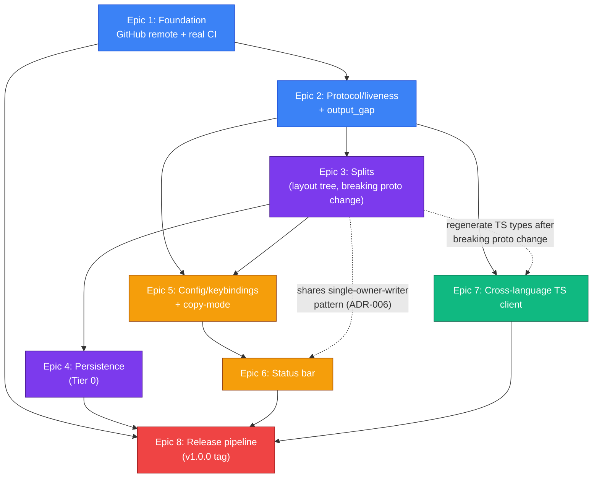

# Implementation Plan: tymux v1.0 Release

**Phase**: 3 (Planning) of the v1-release SDD workflow
**Input**: `project_plans/v1-release/requirements.md`, `project_plans/v1-release/research/{stack,features,architecture,pitfalls,ux,build-vs-buy}.md`
**Output consumed by**: Phase 4 (`validation.md`, `pre-mortem.md`), then Phase 5 implementation
**Companion ADRs**: `project_plans/v1-release/decisions/ADR-001` through `ADR-006`

---

## 0. Sequencing Alternatives Considered (Step 0.5 creative pass)

Before committing to epic order, three distinct high-level delivery strategies were weighed:

| # | Approach | Strength | Weakness |
|---|---|---|---|
| A | **Big-bang single release branch** — build all of splits/persistence/copy-mode/status-bar/TS-client/release-CI on one long-lived branch, merge once complete | No half-finished states visible on `master` in the interim | Directly violates `requirements.md`'s own Risk Control framing ("sequence epics so master stays buildable... after every merge"); huge merge risk; no usable checkpoint until the very end of a Large-appetite, open-timeline project — the worst possible shape for a solo/side-project pace |
| B | **Incremental alpha-tagged milestones** — land epics on `master` in dependency order, tag `v1.0.0-alpha.N` after each major epic, only cut `v1.0.0` once every in-scope item is verified | Matches `requirements.md`'s Risk Control section verbatim; every merge leaves a shippable, installable checkpoint; research's own per-epic sequencing advice (CI first, protocol second, etc.) slots in directly | Some epics share underlying data models (splits' `LayoutNode` shape is a hard dependency of persistence's record format) — requires genuine dependency discipline, not just "merge whenever" |
| C | **Vertical-slice-per-user-story** — cut thin end-to-end slices per user-facing story (e.g. "detach" touches config+CLI+status-bar together), shipping user value fastest | Fastest path to a single demonstrably-useful capability | Fights the grain of this project's own research: `pitfalls.md`'s cross-cutting observation and `features.md`/`ux.md` both independently found that copy-mode and key-bindings **share one piece of new machinery** (local keystroke interception), and splits/persistence/status-bar all need the **same single-owner-writer discipline** (ADR-006). Slicing vertically per-story would force either duplicating this shared infrastructure per-slice or awkwardly cross-referencing slices — the horizontal shared-infra coupling here is unusually strong for this specific project, unlike a typical CRUD feature set |

**Decision: Approach B (incremental alpha-tagged milestones).** It is both the strategy `requirements.md`'s Risk Control section already names and the one best aligned with the research's repeated finding that several "epics" actually share load-bearing infrastructure (ADR-006) that should be built once, deliberately, not per-slice. Approaches A and C are recorded here as rejected, not pursued further.

The 8-epic dependency order below matches the order suggested in the task brief, validated against the research: Epic 2 (protocol/liveness) is placed early because `pitfalls.md`, `ux.md`, and `architecture.md` **each independently** name the liveness field as their single highest-leverage prerequisite fix, and it is small and low-risk relative to splits/persistence, which both consume it. Epic 7 (TS client) is explicitly allowed to start in parallel with Epics 3–6 once Epic 2 lands, per its own two-stage internal validation (unary first, then `Attach`) — this is called out explicitly in the Dependency Visualization below rather than left implicit.

---

## 1. Domain Glossary

| Term | Definition |
|---|---|
| **`LayoutNode`** | Recursive tree type describing one window's pane arrangement. `Leaf { pane_id: Uuid }` or `Split { orientation: Orientation, children: Vec<(LayoutNode, f32)> }` with an enforced 2-children invariant for v1 (ADR-001). Lives in `crates/tymux-core/src/layout.rs` (new file). Purely structural — does not hold live pane handles. |
| **`Orientation`** | `Horizontal` (side-by-side, tmux's `-h`) or `Vertical` (stacked, tmux's default `-v`/no-flag). tymux picks its own CLI verb naming deliberately (per `features.md` §1's note that tmux's own `-h`/`-v` naming is retroactively-mnemonic-only) — see Epic 3, Story 3.5. |
| **`WindowState`** (updated) | `{ id: Uuid, name: String, layout: LayoutNode, active_pane_id: Uuid }`. Replaces the implicit "one pane per session" model. |
| **`SessionState`** (updated) | `{ id: Uuid, name: String, windows: Vec<WindowState>, active_window_id: Uuid }`. Replaces today's `{ id, name, window_id, pane: Arc<Pane> }` (`crates/tymux-core/src/engine.rs:18-23`). |
| **`PaneEntry`** | New flat-map value type: `Live(Arc<Pane>) \| Dead(PersistedPaneRecord)`. `Engine` gains `panes: Mutex<HashMap<Uuid, PaneEntry>>`; `LayoutNode::Leaf` references pane ids into this map, never an `Arc<Pane>` directly (ADR-001 §2). |
| **`Liveness`** | Proto enum: `LIVENESS_UNSPECIFIED = 0`, `LIVENESS_LIVE = 1`, `LIVENESS_DEAD = 2` (proto3 convention: reserve 0 for unspecified rather than overloading it as a real state). Attached to `Pane`, `Session`, `PaneSnapshot`. The single most independently-corroborated recommendation across all 6 research docs. |
| **`PaneLookup`** | Rust-side three-way `Engine` lookup result: `Live(Arc<Pane>) \| Dead(PersistedPaneRecord) \| Unknown`. Replaces today's two-way `Option<Arc<Pane>>` (`crates/tymux-core/src/engine.rs:93-100`) so dead-vs-never-existed are never collapsed into the same `NotFound` (the repeated anti-pattern `pitfalls.md`/`ux.md` both flag). |
| **`PersistedSessionRecord`** | Serializable Tier-0 record: `{ schema_version: u32, session_id, name, created_at, windows: Vec<PersistedWindowRecord>, active_window_id }`. Written as one atomic whole-file replace per session — never a per-pane file (ADR-002's hard invariant). |
| **`PersistedWindowRecord`** / **`PersistedPaneRecord`** | Nested records mirroring `WindowState`/pane metadata, but `PersistedLayoutNode`'s leaves hold `PersistedPaneRecord` (command, cwd, rows, cols) instead of a live `pane_id` reference to nothing. |
| **Tier 0 / Tier 1 / Tier 2 (durability)** | Tier 0 (hard v1.0 requirement): metadata + layout shape survives a daemon restart, dead-flagged. Tier 1 (stretch, not required): auto-relaunch + resume hints + persisted scrollback tail. Tier 2 (ruled out permanently): true live-process resumption (would need CRIU-class checkpointing). See ADR-002. |
| **`ReviveSession`** | New RPC + CLI command (`tymux revive <session_id>`) that explicitly, on user request only, respawns fresh ptys matching a dead session's persisted `LayoutNode` shape. Never triggered automatically on daemon start. |
| **`ScrollbackOffset`** | `pub struct ScrollbackOffset(pub usize)` — 0 = live/bottom of screen, increasing values scroll further back into history. Thin wrapper around `vt100::Screen::set_scrollback`/`scrollback()`, which already implements the underlying ring buffer (`build-vs-buy.md` §3). |
| **`SCROLLBACK_LINES`** | Existing constant at `crates/tymux-core/src/pane.rs:15`, currently hardcoded `0`. Becomes a configurable per-pane bound (default proposed: 5,000 lines) with an explicit global memory ceiling across all live panes (`pitfalls.md` §3) — not just a per-pane default that silently multiplies under splits. |
| **`KeyBinding`** | `{ sequence: Vec<crossterm::event::KeyEvent>, action: Action }`. Matched by a hand-rolled sequence matcher (not the `keybinds` crate — `build-vs-buy.md` §5) against reassembled keystrokes (not raw `read()` chunks — `pitfalls.md` §5). |
| **`PrefixState`** | CLI-local state machine: `Idle \| Armed { since: Instant }`. Drives the prefix-key model (ADR-005). Times out back to `Idle` after a short window (mirrors tmux's `escape-time`). |
| **`Action`** | Enum of bindable actions: `Detach, EnterCopyMode, ExitCopyMode, SplitHorizontal, SplitVertical, NewWindow, NextWindow, PrevWindow, KillPane, SendPrefixLiteral`. Every action with server-side effect has a corresponding first-class RPC (`SplitPane`, `ClosePane`, `CreateWindow`) — purely local actions (`Detach`, copy-mode entry/exit, pane-focus cycling) do not, by design. |
| **`CopyModeState`** | CLI-local: `{ scrollback_offset: ScrollbackOffset, selection: Option<(CellPos, CellPos)>, search_query: Option<String> }`. Vi-style navigation only for v1 (emacs keymap deferred — `features.md` §3). |
| **`WindowSizePolicy`** | `Smallest \| Largest \| Latest \| Manual`. v1 hardcodes `Smallest` (ADR-004); other variants modeled for a future config option, not exposed yet. |
| **`WatchWindow`** | New streaming RPC: `rpc WatchWindow(WatchWindowRequest) returns (stream WindowLayoutEvent)`. Streams structural/geometry change events (the window's `Layout` tree shape) to a client, so it can keep its local model of "which panes exist and where" in sync without polling `ListSessions`. **v1.0 rendering model is explicit focus-cycling, not composited multi-region rendering**: the CLI (Epic 6 Story 6.3) has exactly one single-owner stdout writer forwarding **one pane's** pty output stream at a time, and the user moves the visible pane via client-side "pane-focus cycling" (Epic 5, `NextWindow`/`PrevWindow`/pane-focus actions). `WatchWindow` exists so the client's mental model (and status bar) tracks layout shape correctly even while only one pane's output is on screen — it is not, in v1.0, the transport for simultaneously rendering multiple panes' output with borders in one view. True composited simultaneous multi-pane rendering (tmux/zellij-style, all panes' output visible at once with drawn borders) is an explicit **out-of-scope/deferred item for v1.0** (`ux.md` §10 item 1) — see Epic 3's Goal statement. |
| **`output_gap`** | New `AttachEvent.payload` oneof variant (`bool`), emitted when the per-pane `broadcast::channel(1024)` (`crates/tymux-core/src/pane.rs:27,85`) drops frames for a slow consumer (`Lagged`), so a client can render `[output dropped]` instead of silently showing a discontinuous screen. |
| **`StatusBarModel`** | `{ session_name, windows: Vec<WindowSummary>, active_pane_liveness: Liveness, attached_client_count: u32, mode: InputMode, zoomed: bool }`. Must be introspectable over gRPC (a new `GetStatusBar`-shaped read, or folded into `ListSessions`/`WatchWindow`), not just client-rendered — so an AI-agent client gets equivalent state without ANSI-scraping (the cross-cutting principle `ux.md` §5 and `features.md` §6 both converge on independently). |
| **`InputMode`** | `Normal \| PrefixArmed \| CopyMode`. Drives both the CLI's local key dispatch table and the status bar's mode-reactive rendering (zellij-style live keybinding hints, ADR-005). |
| **`TargetString`** | CLI addressing grammar `session:window.pane` (e.g. `myproject:0.1`), replacing the unchecked `windows[0].panes[0]` indexing in `crates/tymux-cli/src/main.rs:20-30` once more than one window/pane can exist. |
| **`GeometryPolicy` recompute** | The window-level atomic operation "recompute every leaf's rows/cols from the current `WindowSizePolicy` result and apply them together" — the single-owner-writer unit for resize (ADR-004, ADR-006). |
| **Single-owner-writer** | Cross-cutting architectural principle (ADR-006): exactly one task/lock owns (a) window-subtree resize, (b) persistence snapshot-then-write sequencing, (c) the CLI's `stdout` handle during an attach session. |
| **`DaemonStatus`** | New unary RPC response `{ uptime_seconds: u64, session_count: u32, live_pane_count: u32, version: String }` for both human operators and programmatic health checks (Observability Plan, §5). |

---

## 2. Pattern Decisions

| # | Decision point | Chosen | Rejected alternatives | Rationale / source |
|---|---|---|---|---|
| 1 | Epic sequencing strategy | Incremental alpha-tagged milestones | Big-bang branch; vertical-slice-per-story | §0 above; matches `requirements.md` Risk Control verbatim |
| 2 | Layout tree shape | `Vec<(LayoutNode,f32)>` children, **enforced exactly 2** (strict-binary invariant); `Leaf` holds `pane_id: Uuid` not `Arc<Pane>` | True N-ary tree (tmux's real model); `Leaf{pane: Arc<Pane>}` (architecture.md's literal shape) | ADR-001 |
| 3 | Persistence storage + tiers | Flat JSON-per-session file, atomic write-rename; Tier 0 required, Tier 1 stretch, Tier 2 ruled out permanently | `redb`, `rusqlite`, `sled`; auto-respawn on start; CRIU-based live resume | ADR-002, `build-vs-buy.md` §2, `stack.md` §2 |
| 4 | Cross-language client scope | Node.js TS client via `@connectrpc/connect-node`, browser `Attach` explicitly deferred | Adding `tonic-web` and claiming browser support; deferring the whole epic; a different first language | ADR-003 |
| 5 | Concurrent-attacher geometry | Smallest-attached-client-wins, window-level atomic recompute | Last-write-wins (today's actual behavior); largest/latest/manual as default | ADR-004 |
| 6 | Status bar rendering technique | Raw ANSI DECSTBM scroll-region + existing `crossterm` cursor primitives | `ratatui` (full TUI framework) | `build-vs-buy.md` §4, `stack.md` §4 — wrong ownership model for a passthrough architecture |
| 7 | Config file format | `toml` (^1) + `serde` (^1), `~/.config/tymux/config.toml` via `dirs` crate | `serde_yaml` (deprecated); `figment`/`config` (unneeded multi-source layering); bespoke DSL | `build-vs-buy.md` §5 |
| 8 | Key-binding matcher | Hand-rolled sequence matcher against `crossterm`'s existing `KeyEvent`/`KeyCode`/`KeyModifiers` | `keybinds` crate (0.2.0, low adoption); `keyboard-types` (redundant with crossterm) | `build-vs-buy.md` §5 |
| 9 | Key-binding UX model | Prefix-key (tmux vocabulary, default `Ctrl-b`), status bar borrows zellij's mode-reactive hint rendering | Full modal/zellij-style with no default prefix; bare single-key bindings | ADR-005 |
| 10 | Cross-cutting concurrency principle | Single-owner-writer applied to window resize, persistence writes, CLI stdout | Ad hoc per-epic fixes for each of the three races | ADR-006, `pitfalls.md` closing cross-cutting observation |
| 11 | Scrollback storage | Reuse existing `vt100` dependency's native scrollback (`Parser::new(_,_,scrollback_len)`, `Screen::set_scrollback`) | New dedicated terminal-history crate | `build-vs-buy.md` §3, `stack.md` §3 — zero gap to fill, `vt100` already supports this |
| 12 | Release automation tooling | `taiki-e/create-gh-release-action` + `taiki-e/upload-rust-binary-action`, native per-OS runners | `cargo-dist` (more machinery than needed now, viable later); `cross-rs/cross` Docker cross-compile; hand-rolled | `build-vs-buy.md` §7 |
| 13 | Linux release binary libc | `x86_64-unknown-linux-musl` / `aarch64-unknown-linux-musl` (static, no toolchain-version coupling) | `-gnu` targets (glibc-version-coupled to the CI runner's distro) | `pitfalls.md` §7 |

---

## 3. Migration Plan

### 3.1 Breaking proto change: `Window.panes` → `Window.layout`

This is the one deliberate, one-shot breaking change in v1.0's proto surface (pre-1.0, so no external-consumer compatibility burden exists yet — no tagged release has ever shipped). Sequenced as a single PR within Epic 3, Story 3.3, not incrementally:

1. `proto/tymux/v1/tymux.proto`: add `Layout`/`Split`/`LayoutChild` messages; change `Window.layout: Layout` (remove `repeated Pane panes`); add `Liveness` field to `Pane`/`Session`/`PaneSnapshot` (this actually lands in Epic 2, ahead of this change — see §3.2).
2. Regenerate Rust types (`crates/tymux-proto/build.rs`'s `tonic-build` invocation — automatic on next `cargo build`).
3. Update `crates/tymuxd/src/main.rs`'s `session_to_proto` (currently `main.rs:28-42`, a fixed one-window-one-pane builder) to a recursive tree walk over `SessionState.windows` and each window's `LayoutNode`.
4. Update `crates/tymux-cli/src/main.rs`'s `first_pane_id` (`main.rs:20-30`) to the new `TargetString`-based addressing (Epic 3, Story 3.5) — this function's existing bounds-checked design (from ADR 0001) is the right shape to extend, not replace.
5. Any TS client code already generated by Epic 7's earlier unary-RPC validation stage must regenerate against the new `.proto` and re-verify `ListSessions` still round-trips — call this out explicitly as a coordination checkpoint between Epic 3 and Epic 7 if both are in flight simultaneously (see Dependency Visualization).
6. `buf breaking proto` (already run in CI per `.github/workflows/ci.yml:18`) is **expected to report this as a breaking change** — this is fine pre-1.0, but the PR description must say so explicitly rather than let CI's warning look like an accidental regression.

### 3.2 Proto/engine migration ordering within Epic 2 vs. Epic 3

Epic 2's `Liveness` field additions are purely additive (new message fields, default-zero-safe) and land first, independently of Epic 3's breaking `Window.layout` change — this lets Epic 2 tag its own `v1.0.0-alpha.2` checkpoint without waiting on the splits epic's design to finish.

### 3.3 `SessionState` internal refactor migration

`crates/tymux-core/src/engine.rs`'s current `SessionState { id, name, window_id, pane: Arc<Pane> }` and `Engine.sessions: Mutex<HashMap<Uuid, SessionState>>` become `SessionState { id, name, windows: Vec<WindowState>, active_window_id }` plus a new `Engine.panes: Mutex<HashMap<Uuid, PaneEntry>>`. This is an internal-only change (no proto impact by itself) but touches every existing `Engine` method (`create_session`, `list_sessions`, `kill_session`, `pane`) — sequenced as Epic 3 Story 3.2's first task, before any split-specific logic, so the refactor and the new feature are reviewable as separate diffs within the same story.

### 3.4 Persisted-format schema migration policy (forward-looking)

`PersistedSessionRecord.schema_version` starts at `1` when Epic 4 ships. Any future breaking change to the persisted shape must either (a) write a version-aware migration function invoked at load time, or (b) refuse to load a mismatched version with a loud `tracing::error!` and a skip (never a silent `unwrap()`), per ADR-002's consequences. No migration code is needed yet since there is no prior version — this subsection exists to bind future contributors to the policy, per the Observability Requirements' explicit ask.

---

## 4. Observability Plan

Builds on the existing `tracing`/`tracing-subscriber` (`RUST_LOG`-driven) instrumentation already in place across the daemon's session/attach lifecycle (per the is-it-ready fix pass). New instrumentation required for v1.0:

- **Persistence load/save** (Epic 4): `tracing::info!` on every successful save (session id, byte size); `tracing::warn!` + skip on a per-file parse failure at startup (never fatal to daemon boot); `tracing::error!` on a version-mismatch refusal-to-load. This directly satisfies `requirements.md`'s Observability Requirements ask ("corrupted or lost persisted state is visible, not silent").
- **`output_gap` events** (Epic 2): `tracing::warn!` server-side whenever a pane's broadcast channel drops frames for a slow consumer, in addition to the wire-level signal to the client — today this is silent (`crates/tymux-core/src/pane.rs:109-113`'s comment explicitly calls a full channel "benign," which stops being fully true once a client-visible gap signal exists to log alongside).
- **Window-resize race elimination** (Epic 3): `tracing::debug!` on every window-level geometry recompute (window id, triggering client, old/new effective size) — cheap, and directly useful for diagnosing the exact race class `pitfalls.md` §1 flags if it ever resurfaces.
- **Daemon status/health signal** (mechanism decision, per `requirements.md`'s explicit ask to decide structured-log-vs-RPC): **both**, not either/or — a new unary `GetDaemonStatus` RPC (`{ uptime_seconds, session_count, live_pane_count, version }`) for programmatic/agent polling, **plus** a periodic `tracing::info!` structured log line on a fixed interval (proposed default: every 5 minutes, config-overridable) for an operator tailing logs on a long-lived personal daemon. This satisfies both consumer types named in `requirements.md`'s Users/Consumers section without picking one at the expense of the other.
- **Key-binding/copy-mode silent-failure guard** (Epic 5): any local-interception code path that swallows or misroutes a keystroke (e.g. an incomplete escape sequence at end-of-buffer) must log at `tracing::debug!` on the CLI side (not silently drop) — mirrors the is-it-ready review's already-established "no silent failure" convention.
- **Structured error convention** (cross-cutting, Epics 3-6): every new v1.0 error case (undersized split, dead-pane restore, copy-mode-on-exited-pane, persisted-session-restore) produces a stable `tonic::Status` code + structured detail *and* flows through the CLI's existing `friendly_message` translation layer (`crates/tymux-cli/src/main.rs:93-103`) — extended, not duplicated, for each new case.

---

## 5. Risk Control

Per `requirements.md`'s own framing (no feature-flag infrastructure planned or needed for a single-daemon personal tool): risk control is entirely about sequencing and checkpoints.

- **`master` stays buildable and passing CI after every merge** — enforced mechanically once Epic 1 lands (branch protection requiring the CI workflow to pass before merge).
- **Alpha-tag checkpoint after every epic**, each one an installable, working state — **and, per pre-mortem.md's P1 finding, each checkpoint's tag message must answer one explicit question: "is `master` more usable day-to-day, right now, than the pre-1.0 MVP it's replacing?"** If the answer is no, that is itself a signal to reprioritize the next epic's scope before continuing, not just note it and move on:
  - `v1.0.0-alpha.1` — after Epic 1 (real CI, GitHub remote)
  - `v1.0.0-alpha.2` — after Epic 2 (liveness field, `output_gap`)
  - `v1.0.0-alpha.3` — after Epic 3 (splits, breaking proto change)
  - `v1.0.0-alpha.3.5` — **new checkpoint** (pre-mortem.md P1 prevention): a minimal Detach + NextWindow/PrevWindow keybinding slice, pulled out of Epic 5's Story 5.2/5.3 scope and shipped immediately after Epic 3 rather than strictly after Epic 4 — this does not require Epic 5's full config/copy-mode machinery, only enough of Story 5.2's keystroke-reassembly + prefix-state-machine to support these three actions. Rationale: without this, `master` after Epic 3 has multi-window addressing complexity (`TargetString`, explicit `tymux split`/`tymux attach session:window.pane` commands) but no keybinding to detach or cycle panes — objectively worse day-to-day UX than the pre-1.0 single-pane MVP, and the point at which a solo/open-timeline project is most likely to stall (pre-mortem.md Failure #1). Epic 5's remaining stories (full config file, copy-mode, remaining bindings) proceed after this slice ships.
  - `v1.0.0-alpha.4` — after Epic 4 (Tier-0 persistence)
  - `v1.0.0-alpha.5` — after Epic 5 (config/keybindings + copy-mode, remainder not already shipped in alpha.3.5)
  - `v1.0.0-alpha.6` — after Epic 6 (status bar)
  - `v1.0.0-alpha.7` — after Epic 7 (TS client, may land in parallel — tag whenever it completes relative to 3-6)
  - `v1.0.0` — only once every in-scope item in `requirements.md` is verified working end-to-end (Epic 8's final gate)
- **Hard test gates, not just "tests exist"**:
  - Epic 3 cannot merge without the property-based/invariant test suite for `LayoutNode` (ADR-001's consequences: ratio-sum invariant, min-size floor, tree-validity-after-any-sequence) — `build-vs-buy.md` §8 names this as the one place a plausible-looking implementation can hide a real bug, and explicitly recommends a human/reviewer pass on the resize-propagation function specifically, not agent-only implementation. **Per pre-mortem.md Failure #4, "the suite exists" is not sufficient to satisfy this gate**: it must also (a) generate trees to a minimum configured depth (not just 2-3 panes), (b) explicitly exercise the named nested-collapse and odd-remainder-rounding cases as dedicated proptest strategies, not just hope the random generator finds them, and (c) include one mutation-testing check — deliberately break the ratio-sum invariant in a throwaway local edit and confirm the suite fails — before the gate is considered satisfied.
  - Epic 4 cannot merge without a test that kills and restarts a daemon mid-session and asserts the reloaded record matches the pre-restart `LayoutNode` shape.
  - Epic 7's `Attach` validation cannot be marked done on the strength of the unary (`ListSessions`) checkpoint alone — the bidi-stream checkpoint is a separate, required gate (`architecture.md` §3, `pitfalls.md` §6). **Per pre-mortem.md Failure #5, Epic 7 also cannot be marked done until its `Attach`+`CapturePane` integration test is wired into CI as a standing job on every subsequent PR** (mirroring Story 7.2 Task 3's treatment of the unary smoke test) — proving the cross-language claim once and then letting it silently regress after Epic 7 merges is the same class of gap as "tests exist but don't run."
  - **Per pre-mortem.md Failure #3, Story 1.2's ongoing PR-gating CI matrix must include a build-only `cargo build --workspace --target x86_64-unknown-linux-musl` step from Epic 1 onward** (not just Story 1.4's one-time throwaway spike) — otherwise nothing continuously verifies musl compatibility as Epics 4/5 add new dependencies (`serde_json`, `vt100` 0.16.2, `toml`/`dirs`), deferring discovery of a regression back to Epic 8's real release cut, exactly the "validated dead last" shape the original spike existed to avoid.
- **Sequencing discipline for shared infrastructure** (ADR-006): the single-owner-writer pattern is implemented once per surface (window resize in Epic 3, persistence sequencing in Epic 4, CLI stdout in Epic 6) and referenced, not reinvented — a story that appears to need a fourth independent variant of this pattern is a signal to stop and re-examine before writing new code.
- **No regression of the is-it-ready fix pass**: every new epic's test suite must be additive to, not replace, the existing regression tests already named in the codebase (`attach_streams_output_and_signals_exit` in `crates/tymuxd/src/main.rs`, `wait_exit_resolves_after_child_exits` in `crates/tymux-core/src/pane.rs`) — CI running these on every PR is what makes this enforceable, which is exactly why Epic 1 is first.

---

## 6. Unresolved Questions

These are explicitly left open past this plan — Phase 4 (`validation.md`/pre-mortem) or Phase 5 implementation should resolve them, not silently pick an answer:

1. **Exact `SCROLLBACK_LINES` default and global memory ceiling.** This plan proposes 5,000 lines/pane default with a global ceiling (e.g. "cap total retained scrollback across all live panes at N MB, evict oldest-inactive-pane's scrollback first if exceeded") but the precise numbers need a real measurement pass against `PaneSnapshot`'s actual per-cell memory cost (`crates/tymux-core/src/pane.rs:60-65`'s `CellSnapshot` — heap `String` + 3×`u32` per cell) before being finalized, not just picked from a hunch.
2. **`RESOLVED` at Epic 8 implementation time — Linux ARM64 build path is cross-compilation from `ubuntu-latest`, not a native ARM runner.** Both `ci.yml`'s continuous `musl-build` matrix and `release.yml`'s release matrix build `aarch64-unknown-linux-musl` via `taiki-e/setup-cross-toolchain-action` from an `ubuntu-latest` (x86_64) host, rather than a native `ubuntu-24.04-arm` runner. This was simpler to wire up and validated cleanly (dry-run in Unresolved Question #14 below); revisit only if a real cross-linking issue surfaces that a native runner would avoid.
3. **Default leader key**: this plan proposes `Ctrl-b` (tmux parity) as the *default*, configurable. Whether `Ctrl-a` (screen/tmux-remap convention) should instead be the default is a low-stakes bikeshed intentionally left to Epic 5 implementation-time judgment rather than blocking planning.
4. **Repository visibility/org and exact GitHub remote target** (personal account vs. an org) — an Epic 1 prerequisite decision with zero technical content, deliberately left to the human developer rather than this plan.
5. **Whether a Homebrew formula / `cargo-dist`-style installer script is worth adding post-1.0.** Explicitly deferred (`build-vs-buy.md` §7: "cargo-dist is Viable as a later upgrade") — not an open question blocking v1.0, but flagged so it isn't silently forgotten.
6. **Vi-only copy-mode keymap for v1** (emacs deferred) — this plan adopts `features.md` §3's recommendation without objection found in research, but is called out here as a scope decision a reviewer should explicitly bless before Epic 5 implementation, since it's a user-facing default with no config escape hatch in v1.
7. **Tier 1 persistence (auto-relaunch/resume hints)** — explicitly a stretch goal (ADR-002); whether it gets attempted at all depends on remaining appetite after Tier 0 ships and is not scheduled as a numbered story in this plan (see Epic 4's stories — Tier 1 is deliberately absent, not silently included).
8. **`Engine` lock granularity: single global mutex vs. per-session/finer-grained locking.** `architecture.md` §4 explicitly flags that `Engine`'s mutex(es) (`sessions` and, from Epic 3 Story 3.4, `panes`) serialize *all* sessions' operations against each other, and calls this "worth flagging as a lock-granularity decision to revisit" once split/resize operations happen at keystroke-adjacent frequency across many concurrently-active panes. This plan keeps the single-mutex-per-map design for v1.0 (see Epic 3 Story 3.4's new locking-discipline subsection) rather than introducing per-session sharding, but whether that remains acceptable once real multi-session, multi-pane usage is observed is left open rather than decided from research alone — Phase 4/5 or a post-1.0 pass should revisit it with real measurements, not assumptions.
9. **`RESOLVED` at Epic 6 implementation time — `StatusBarModel` folded into `WindowLayoutEvent`, not a new RPC.** `attached_client_count` (the one server-known field the CLI's local `InputMode`/`PrefixState` rendering can't already derive itself) was added directly to `WindowLayoutEvent` (Epic 3's `WatchWindow` stream). A dedicated `GetStatusBar` RPC would have been a redundant second subscription to the same window's state for any client that already needs `WatchWindow` for layout changes — folding it in means one stream, one source of truth, per window.
10. **`RESOLVED` at Epic 1 implementation time — macos-13 (Intel) CI leg dropped.** Story 1.2 Task 2 originally called for a `macos-13` matrix leg to validate `x86_64-apple-darwin` isn't compile-only-and-untested. In practice, GitHub-hosted `macos-13` runners queued indefinitely (50+ minutes, job never left `queued` state) on this repo — a real capacity/deprecation issue as GitHub shifts hosted macOS fleets to Apple Silicon, not transient flakiness. Decision: the `test` matrix in `.github/workflows/ci.yml` covers `ubuntu-latest`/`macos-latest` (Apple Silicon) only; `x86_64-apple-darwin` is validated at Epic 8 release-build time (Story 8.1's four-target matrix) rather than continuously on every PR. If GitHub's Intel runner availability improves later, re-adding `macos-13` is a one-line matrix change, not a design change.
11. **`RESOLVED` at Epic 3 implementation time, test gap closed at repair-pass time — Story 3.4 AC3's concurrency test uses real timing, not a `SlowMockPane` test double.** The plan named a `SlowMockPane`/mock-resize test double (mirroring Story 4.2's `SlowMockPersistenceBackend` pattern) to deterministically prove `ListSessions` on an unrelated session isn't blocked while a window's resize syscalls are in flight. Building that abstraction would mean introducing a `PtyBackend`-style trait solely for this one test, with no other caller — a real abstraction cost for a single assertion. Implemented instead: the lock-release-around-`Pane::resize()` discipline itself (compute geometry under `sessions`/`panes`, release both, then call `Pane::resize()` outside either lock — see `Engine::recompute_window_geometry`), which is the actual correctness property. At Epic 3 merge time this resolution note claimed the property was "exercised by real `Engine`/daemon integration tests using genuine ptys" — that follow-up test was never actually written, so the claim was inaccurate. **Closed at repair-pass time**: `crates/tymux-core/src/engine.rs`'s `list_sessions_should_not_block_on_unrelated_session_while_window_resize_syscalls_in_flight` is a real `Engine`-level integration test using genuine ptys (no mock/test double) — it spawns a real 4-pane window, resizes it to a large enough real size (~1200x1200 cells per pane) that the underlying `vt100::Parser` screen reallocation takes a genuinely measurable few hundred milliseconds, and asserts a concurrent `list_sessions()` call completes in a small, self-calibrated fraction of that time rather than scaling with it. Writing this test surfaced a real, narrower bug beyond the one `recompute_window_geometry`'s own lock-release discipline already covered: `Engine::list_sessions()` (which returns *every* session in one pass, including whichever session happens to be mid-resize) was calling `Pane::size()` for each live pane while still holding the `sessions`/`panes` locks, and `Pane::size()` locked the same per-pane `vt100::Parser` mutex that `Pane::resize()` holds for the real duration of a large `Screen::set_size` reallocation — so a `list_sessions()` call unlucky enough to read a pane mid-resize would block on that pane's lock *while still holding the Engine-wide locks*, reintroducing the hang class on the read side. Fixed with two changes, both real (no mocks): (1) `list_sessions()` now resolves each leaf to a cheap `PaneHandle`/`LayoutHandle` (an `Arc` clone, no per-pane lock touched) under `sessions`/`panes`, then releases both locks before reading any live pane's actual size/exited status; (2) `Pane` now caches its current `(rows, cols)` in a pair of atomics, updated by `resize()` right after `Screen::set_size` completes, and `Pane::size()` reads those atomics instead of locking `parser` at all — eliminating the per-pane contention rather than just moving it outside the Engine-wide lock. The test fails without either fix and passes with both (verified by reverting each independently).
12. **`RESOLVED` at Epic 3 implementation time — Story 3.4 Task 12 (P3, serializing overlapping resize-recompute triggers for the same window) deferred, per the plan's own priority note.** Not implemented in Epic 3; each individual `report_viewport_and_recompute`/`recompute_window_geometry` call is internally atomic (computed under lock, applied outside), but two overlapping triggers for the same window could theoretically apply a superseded geometry after a newer one. The plan explicitly marks this lower-priority and non-blocking for Epic 3's merge — left for a future pass if real multi-client concurrent-resize usage surfaces the race in practice.
14. **`RESOLVED` at Epic 8 implementation time — Story 8.1 Task 4's dry-run surfaced and fixed two `release.yml` bugs before they could hit the real `v1.0.0` cut.** First attempt (tagged `v1.0.0-alpha.7`): all four `upload-assets` legs failed — `taiki-e/upload-rust-binary-action`'s default archive name (`$bin-$target`) only works for a single binary, and `bin: tymuxd,tymux-cli` names two; fixed by setting `archive: tymux-$target` explicitly. Second attempt: all four legs failed again — `error: no bin target named tymux-cli in default-run packages`; `crates/tymux-cli/Cargo.toml`'s package is named `tymux-cli` but its `[[bin]]` target is named `tymux` (matching every CLI invocation elsewhere in the project), and `release.yml` had used the package name. Third attempt succeeded: all four archives (`x86_64`/`aarch64` × `musl`/`darwin`) uploaded, each verified (via `tar tzf`) to contain both `tymuxd` and `tymux`. This is exactly the failure mode Task 4 exists to catch before the real `v1.0.0` tag, and it worked as designed.
15. **`RESOLVED` at Epic 5 implementation time — `KeystrokeReassembler` hand-rolls its own byte classifier rather than calling into `crossterm`'s ANSI parser.** Story 5.2's task text says to leverage "`crossterm::event`'s existing raw-mode parsing primitives." In practice `crossterm` 0.28's byte-to-event parser (`event::sys::unix::parse`) is entirely private to the crate — it's only reachable via `crossterm::event::read()`/`EventStream`, which read directly from the OS terminal fd and consume the bytes internally. That's incompatible with tymux's passthrough architecture, which needs the *same* raw bytes both interpreted locally (for binding matching) and forwarded untouched to the pty for anything unmatched. Resolution: `KeystrokeReassembler` reuses `crossterm::event`'s public *types* (`KeyEvent`/`KeyCode`/`KeyModifiers`, matching `KeyBinding`'s glossary shape exactly) but implements its own minimal byte classifier — this is sufficient because every one of ADR-005's default bindings is a single control-byte leader (e.g. `Ctrl-b` = `0x02`) followed by one plain ASCII char; no multi-byte escape sequence (arrows, F-keys, kitty keyboard protocol) is needed for v1.0's binding set. Anything outside that shape (multi-byte escapes, non-ASCII UTF-8) is treated as ordinary unmatched input and forwarded raw, exactly as today. This is the same "hand-rolled sequence matcher, not a full parser" posture `build-vs-buy.md` §5 already recommended for the *matcher*; this note extends it to the *byte-to-KeyEvent* step, which the original task text didn't anticipate would also need to be hand-rolled.
16. **`RESOLVED` at repair-pass time (post-Epic-4 test-coverage sweep) — Story 4.5 AC1's "final persistence flush" is implemented as synchronous-write-per-mutation, not a dedicated shutdown-time flush step, and `shutdown_signal()`'s doc comment in `crates/tymuxd/src/main.rs` already explains why.** Every mutating RPC handler (`create_session`, `split_pane`, `close_pane`, `kill_session`, `create_window`, window resize, `revive_session`) calls `PersistenceBackend::save` synchronously and awaits it before the RPC response is returned to the caller — so by the time any client observes a successful mutation, that mutation is already durable on disk. There is therefore nothing left "pending" for `shutdown_signal()` to drain when SIGTERM/Ctrl-C arrives; a dedicated flush step would have nothing to flush. This is a reasonable interpretation of AC1's literal wording ("a final persistence flush completes before the process exits") but is a real deviation from a shutdown-time flush *step*, and it went unlogged here at Epic 4 merge time even though ~15 other deliberate deviations were recorded. Recorded now, retroactively: the repair-pass sweep added `shutdown_signal_should_flush_pending_persistence_before_process_exits_on_sigterm` (`crates/tymuxd/tests/sigterm_flush.rs`) — a real `tymuxd` subprocess test that creates a session, splits it, sends a genuine SIGTERM (not `Child::kill()`'s SIGKILL), waits for real process exit, then restarts a fresh daemon against the same state dir and asserts the pre-SIGTERM session/split structure survived intact — empirically proving AC1's real-world guarantee (nothing is lost on SIGTERM) holds under the synchronous-write-per-mutation design, even without a dedicated flush step.

---

## 7. Dependency Visualization

**Reading this graph**: Epic 7 (TS client) can start as soon as Epic 2 lands and run in parallel with Epics 3-6, provided it re-syncs its generated types after Epic 3's breaking proto change (dotted edge). Epic 8 is the only node requiring every other epic complete — it is the final gate, not a parallel track. The solid `E3 --> E5` edge (distinct from the dotted E3-to-E6/E3-to-E7 edges, which mark shared-pattern/re-sync references rather than hard ordering) reflects a real sequencing dependency, not just a shared-infrastructure note: the `v1.0.0-alpha.3.5` checkpoint (§5 Risk Control) pulls a minimal Detach/NextWindow/PrevWindow slice out of Epic 5 to ship immediately after Epic 3, and Story 5.3 AC2 explicitly reuses Epic 3's `SplitPane` RPC — so Epic 5 cannot be considered "done" (nor even meaningfully started, for its alpha.3.5 slice) until Epic 3's proto/engine surface exists.

---

## 8. Epics, Stories, and Tasks

Task sizing target: 2-5 hours each, touching at most 3-5 files. Every story's acceptance criteria include a concrete Given-When-Then example using Domain Glossary terms and real values.

### Epic 1 — Foundation: GitHub remote + real CI

**Goal**: Close the prerequisite gap every later epic's "shippable checkpoint" story depends on. No git remote exists yet; the single-job CI in `.github/workflows/ci.yml` has never run against a real PR.

#### Story 1.1 — Stand up the GitHub remote and confirm existing CI runs for real

**Acceptance criteria**:
- **AC1**: Given a fresh GitHub repository with no prior remote, when the local `master` branch is pushed and a PR is opened against it, then the existing single-job `.github/workflows/ci.yml` workflow triggers and completes (pass or fail) — visibly, on GitHub, not just locally.
- **AC2**: Given the CI workflow has run at least once successfully, when branch protection is enabled on `main`, then a PR cannot merge until the `test` job passes.

**Tasks**:
1. Create the GitHub repository (visibility per Unresolved Question #4), add it as `origin`. *(no files changed)*
2. Push `master`, rename to `main` if adopting that convention; open a throwaway PR to trigger CI once. *(no files changed)*
3. Confirm `.github/workflows/ci.yml`'s `buf lint`/`cargo fmt`/`cargo clippy`/`cargo test` steps all pass against the real runner; fix any drift found (first real signal this project has ever had). Files: `.github/workflows/ci.yml`, whichever source files CI flags.
4. Enable branch protection on `main` requiring the `test` job. *(GitHub settings, no repo files changed)*

#### Story 1.2 — Expand PR-gating CI to a cross-platform compile matrix

**Acceptance criteria**:
- **AC1**: Given a PR that changes any Rust source file, when CI runs, then the workflow builds the workspace on both `ubuntu-latest` and `macos-latest`, not just Linux — catching, for example, whether `crates/tymux-cli/src/main.rs`'s `#[cfg(unix)]` block at `main.rs:230-247` even compiles on macOS (never verified until now).

**Tasks**:
1. Add a `matrix: os: [ubuntu-latest, macos-latest]` strategy to the existing `test` job in `.github/workflows/ci.yml`, keeping `buf lint`/`fmt`/`clippy` Linux-only (no need to duplicate lint-only steps per OS) but running `cargo build --workspace` and `cargo test --workspace` on both.
2. Add `macos-13` (Intel) as a third matrix leg specifically for `cargo test --workspace` (not full lint) to validate `x86_64-apple-darwin` isn't compile-only-and-untested, per `pitfalls.md` §7's explicit call-out.
3. Fix any macOS-specific compile break surfaced (expected candidate: `portable-pty`'s platform pty bindings, `crates/tymuxd/src/main.rs:299-310`'s `#[cfg(unix)]` SIGTERM handler).
4. Add a build-only `cargo build --workspace --target x86_64-unknown-linux-musl` step to the `test` job in `.github/workflows/ci.yml`, running on every PR from this story onward (not a test-and-run step — the musl target has no bundled test runner on `ubuntu-latest` without extra setup, so this is compile-verification only). This is the standing, continuously-run musl-compatibility check §5 Risk Control's pre-mortem.md Failure #3 prevention requires — distinct from Story 1.4's one-time throwaway `spike-musl-pty` crate, which is deleted after its spike runs; this task wires the permanent PR-gating equivalent so a later dependency (`serde_json`, `vt100` 0.16.2, `toml`/`dirs`) can't silently break musl compatibility between now and Epic 8's release cut.

#### Story 1.3 — Pin one source of truth for version numbers

**Acceptance criteria**:
- **AC1**: Given `Cargo.toml`'s `[workspace.package] version = "0.1.0"` (`Cargo.toml:11`), when a `v*` git tag is pushed, then CI verifies the tag's version matches the workspace version (or the release workflow reads the version from `Cargo.toml` directly rather than trusting the tag string), so they can never silently drift.

**Tasks**:
1. Add a small CI check step (new job or step in `.github/workflows/ci.yml`, triggered only on tag pushes) comparing `git describe --tags` against `cargo metadata`'s workspace version; fail loudly on mismatch.
2. Document the convention ("bump `Cargo.toml` version, then tag — CI enforces they match") in `README.md`'s Dev setup section.

#### Story 1.4 — Early spike: validate `portable-pty` cross-compiles to musl, before any other epic starts

**Why here, why first**: Pattern Decision #13 commits Epic 8's release binaries to `x86_64-unknown-linux-musl`/`aarch64-unknown-linux-musl` specifically to avoid glibc-version coupling, but whether `portable-pty`'s C dependencies can even statically link against musl has never been validated — it is explicitly called "unvalidated" in `pitfalls.md` §7. Story 1.2's cross-platform CI matrix only exercises `ubuntu-latest`/`macos-latest`/`macos-13` (native `-gnu`/Darwin toolchains), so this risk would otherwise get zero coverage until Epic 8, after 7 epics of work are already sunk into a release plan whose binary-distribution success metric could fail at the last mile (adversarial-review.md Blocker #1). This spike must run before Epic 2-7 work starts, not deferred to Epic 8.

**Acceptance criteria**:
- **AC1**: Given a trivial throwaway binary crate that depends on `portable-pty` and does nothing but open a pty and print a byte through it, when it is cross-compiled with `cross` or a musl toolchain to `x86_64-unknown-linux-musl`, then the build succeeds and the resulting static binary runs successfully in a minimal (non-glibc) container, proving `portable-pty` links cleanly against musl.
- **AC2**: Given the spike fails (musl cross-compile of `portable-pty` cannot be made to work, or requires unreasonable hacks), then the explicit, written fallback documented in this story is adopted immediately (see below) rather than left to be improvised at Epic 8.

**Fallback (written now, not improvised later)**: if AC1 cannot be achieved within this spike, Epic 8's Story 8.1 target matrix switches from `x86_64-unknown-linux-musl`/`aarch64-unknown-linux-musl` to `x86_64-unknown-linux-gnu`/`aarch64-unknown-linux-gnu`, built on the oldest still-supported Ubuntu LTS GitHub-hosted runner available at Epic 8 implementation time, with a documented minimum-glibc-version requirement published in `README.md`'s install instructions (per Story 8.2). Pattern Decision #13 is revised accordingly at that point rather than silently left inaccurate.

**Tasks**:
1. Scaffold a throwaway `spike-musl-pty` binary crate (not part of the workspace's shipped members, or removed after the spike) with a single `portable-pty` dependency and a minimal pty-open-and-echo `main()`.
2. Install/configure the musl cross toolchain (e.g. `cross` or `rustup target add x86_64-unknown-linux-musl` + a musl C toolchain) and attempt the cross-compile.
3. Run the resulting static binary inside a minimal musl-based container (e.g. `alpine`) to confirm it actually executes, not just links.
4. Record the outcome (pass/fail, and any linker flags/workarounds required) directly in this story's text or in a short `docs/adr/` note; if it failed, explicitly trigger the fallback above and update Pattern Decision #13 and Epic 8 Story 8.1 to reference `-gnu` targets instead.
5. Delete the throwaway spike crate once the outcome is recorded (or fold its working config into Epic 8's real release tooling if it succeeded).

---

### Epic 2 — Protocol/liveness foundation

**Goal**: Add the single most independently-corroborated missing piece (a liveness signal) plus the `output_gap` wire signal, before splits/persistence/status-bar/copy-mode all need to consume it.

#### Story 2.1 — Add `Liveness` enum and fields to the proto

**Acceptance criteria**:
- **AC1**: Given a `Session` returned from `ListSessions` whose sole pane's child process has exited, when a client reads `Pane.liveness`, then it reads `LIVENESS_DEAD`, not `LIVENESS_UNSPECIFIED` or an absent field.
- **AC2**: Given a freshly-created session via `CreateSession`, when the response is inspected, then every `Pane.liveness` is `LIVENESS_LIVE`.

**Tasks**:
1. Add `enum Liveness { LIVENESS_UNSPECIFIED = 0; LIVENESS_LIVE = 1; LIVENESS_DEAD = 2; }` and a `liveness` field to `Pane`, `Session`, and `PaneSnapshot` messages in `proto/tymux/v1/tymux.proto`.
2. Regenerate and confirm `crates/tymux-proto/src/lib.rs` compiles (generated via `crates/tymux-proto/build.rs`, no manual edit needed).
3. Wire `Pane::is_exited()` (`crates/tymux-core/src/pane.rs:129-131`, already exists) through to `session_to_proto`/`snapshot_to_proto` in `crates/tymuxd/src/main.rs:28-67`, mapping `true`→`LIVENESS_DEAD`, `false`→`LIVENESS_LIVE`.
4. Add a daemon-side regression test asserting a session with an exited pane reports `LIVENESS_DEAD` from `list_sessions` (new test in `crates/tymuxd/src/main.rs`'s `#[cfg(test)] mod tests`).

#### Story 2.2 — Add `output_gap` signal to `AttachEvent`

**Acceptance criteria**:
- **AC1**: Given a slow `Attach` consumer whose `broadcast::Receiver` falls far enough behind that `pane.rs`'s `output_tx` (capacity 1024, `crates/tymux-core/src/pane.rs:27,85`) drops frames, when the consumer's next `recv()` returns `Err(Lagged(n))`, then the daemon forwards an `AttachEvent { payload: Some(OutputGap(true)) }` to the client instead of silently continuing.

**Tasks**:
1. Add `bool output_gap = 4;` to `AttachEvent.payload`'s oneof in `proto/tymux/v1/tymux.proto`.
2. In `crates/tymuxd/src/main.rs`'s `attach()` forwarding loop (`main.rs:191-215`), handle `Err(broadcast::error::RecvError::Lagged(n))` from `output_rx.recv()` explicitly (today's `Err(_) => return` treats it as stream-end) — send one `OutputGap(true)` event, log `tracing::warn!`, then resume receiving.
3. Update `crates/tymux-cli/src/main.rs`'s attach event match (`main.rs:194-205`) to render `[tymux: output dropped]` on `OutputGap` instead of falling into the `_ => {}` no-op arm.
4. Add a regression test simulating a slow consumer (small channel, burst of sends) asserting an `OutputGap` event is observed before normal output resumes.

#### Story 2.3 — Strengthen `Attach` RPC-level doc comments + clean signal on out-of-band `KillSession`

**Acceptance criteria**:
- **AC1**: Given a TS client author reading Connect-ES-generated docs for the `Attach` method, when they view the RPC's own doc comment (not a buried field comment), then it states: the first `AttachRequest` must set `pane_id` (else `invalid_argument`); detach means full call cancellation, not half-close; and what `output_gap` means.
- **AC2**: Given Client A is attached to a pane in session S, when Client B calls `KillSession(S)`, then Client A's `Attach` stream receives a distinct, well-formed terminal event (e.g. the existing pane-exited signal, or a new explicit `SessionKilled` payload variant) before the stream closes cleanly — never a bare stream error, a silent indefinite hang, or an unhandled disconnect. This is the same failure class as the already-fixed Ctrl-D hang and must not be silently reintroduced by `KillSession`'s teardown path.

**Tasks**:
1. Move/duplicate the existing message-ordering contract (currently only at `proto/tymux/v1/tymux.proto:84`'s field comment) onto the `Attach` RPC declaration's own doc comment in `proto/tymux/v1/tymux.proto:20`.
2. Add explicit doc-comment text: "Detach = fully cancel this call. Half-closing only the send side does not stop the receive side," matching `architecture.md` §3 point 2's recommendation.
3. Add a one-line doc comment on the new `output_gap` field explaining the lossy-broadcast-channel semantics it signals.
4. Implement `KillSession`'s teardown path so it explicitly signals every attached client of the killed session before dropping their streams: reuse the existing `PaneChildProcessExited → EmitAttachEventExited` event shape (`crates/tymuxd/src/main.rs`'s attach forwarding loop, Story 2.2's area) rather than inventing a parallel mechanism, ensuring each attached pane's forwarding loop observes the pty teardown and emits its normal exit event prior to the stream actually closing.
5. Add a regression test: attach a test client to a pane, call `KillSession` on that session from a second simulated client, and assert the first client's `Attach` stream observes a clean terminal event (not a raw `Err`/timeout) before the stream ends — the direct counterpart to the already-fixed Ctrl-D hang regression test.

#### Story 2.4 — `Engine`-side three-way pane lookup (`Live`/`Dead`/`Unknown`)

**Acceptance criteria**:
- **AC1**: Given a `pane_id` that was never created, when `Engine::pane_lookup(pane_id)` is called, then it returns `PaneLookup::Unknown`.
- **AC2**: Given a `pane_id` whose backing process has exited but the session record still exists, when `Engine::pane_lookup(pane_id)` is called, then it returns `PaneLookup::Dead(record)`, distinct from `Unknown`.

**Tasks**:
1. Introduce `PaneLookup` enum in `crates/tymux-core/src/engine.rs` (new type alongside `SessionInfo`).
2. Replace `Engine::pane()`'s current `Option<Arc<Pane>>` return (`engine.rs:93-100`) with `pane_lookup() -> PaneLookup`, updating its doc comment (the "flat across sessions since each session has exactly one" comment is now stale in its stated reason and must be corrected, not just left).
3. Update `crates/tymuxd/src/main.rs`'s `capture_pane`/`attach` handlers (`main.rs:137-151`, `173-177`) to match on all three `PaneLookup` variants, returning a distinct `tonic::Status` for `Dead` (e.g. `Status::failed_precondition("pane exited — run 'tymux revive <session_id>' to respawn it")`, naming the concrete `tymux revive <id>` remediation, matching Story 4.6's equivalent message pattern) vs. `Unknown` (`Status::not_found`).
4. Add unit tests for all three lookup outcomes in `crates/tymux-core/src/engine.rs`'s test module.

---

### Epic 3 — Splits (engine layout tree + breaking proto change + daemon + CLI addressing)

**Goal**: Real multi-window, multi-pane sessions per ADR-001. The highest-correctness-risk epic in the whole plan (`build-vs-buy.md` §8) — property-based tests are a hard merge gate, not optional polish. **Scope note**: v1.0 ships the layout *model* (multiple panes/windows per session, addressable and independently resizable) but not composited *rendering* of multiple panes simultaneously on screen — a client interacts with one focused pane at a time, cycling focus via keybinding (Epic 5). True side-by-side composited rendering with drawn borders is out of scope for v1.0 (see the Domain Glossary's `WatchWindow` entry and `ux.md` §10 item 1); this epic builds the tree/geometry model that a future composited renderer would consume, without building that renderer itself.

#### Story 3.1 — `LayoutNode`/`Orientation` types and pure geometry computation

**Acceptance criteria**:
- **AC1**: Given a window's root `LayoutNode::Split { orientation: Horizontal, children: [(Leaf{A}, 0.5), (Leaf{B}, 0.5)] }` and a window size of 80 cols × 24 rows, when `compute_geometry(24, 80)` is called, then it returns `[(A, PtyRect{row:0,col:0,rows:24,cols:40}), (B, PtyRect{row:0,col:40,rows:24,cols:40})]`.
- **AC2**: Given the same tree but resized to 81 cols (odd remainder), when `compute_geometry` runs, then the remainder column is assigned to the last child, not dropped or duplicated.

**Tasks**:
1. Create `crates/tymux-core/src/layout.rs`: define `Orientation`, `LayoutNode`, `PtyRect`.
2. Implement `LayoutNode::compute_geometry(&self, rows: u16, cols: u16) -> Vec<(Uuid, PtyRect)>` as a pure recursive function (ratio-weighted subdivision, remainder to last child).
3. Add `mod layout;` to `crates/tymux-core/src/lib.rs`, export `LayoutNode`/`Orientation`/`PtyRect`.
4. Unit tests: 2-child horizontal split exact division; odd-remainder rounding; nested split (3 leaves via 2 nested binary splits) geometry sums correctly to parent rect.

#### Story 3.2 — Tree mutation operations + property-based invariant tests

**Acceptance criteria**:
- **AC1**: Given a 2-pane horizontal split window, when `LayoutNode::split(target_pane_id, Orientation::Vertical, new_pane_id)` is called on the leaf for `target_pane_id`, then that leaf becomes a `Split{Vertical, [(old_leaf, 0.5), (new_leaf, 0.5)]}` nested inside the original tree, and the original sibling pane is untouched.
- **AC2**: Given a 2-child split where one child closes, when `LayoutNode::remove(closed_pane_id)` is called, then the `Split` node is replaced entirely by its surviving child (recursive collapse), matching `features.md` §1's named trickiest correctness case.
- **AC3**: Given any sequence of `split`/`remove`/`resize` operations generated by a property-based test (e.g. via `proptest`), when the resulting tree is inspected after each step, then every `Split` node's children ratios sum to 1.0 within floating-point tolerance, no leaf's computed rect ever falls below the configured minimum — named constants `MIN_PANE_ROWS`/`MIN_PANE_COLS` (e.g. 2 rows × 10 cols) — and no zero- or one-child `Split` node exists. **Note**: `MIN_PANE_ROWS`/`MIN_PANE_COLS` is the hard, low-level anti-corruption floor enforced structurally by `LayoutNode::split` itself — deliberately a different, lower tier than Story 3.5 AC2's `RECOMMENDED_SPLIT_MIN_ROWS` (e.g. ~20 rows), a higher, usability-oriented threshold the CLI message cites before the user ever gets close to this hard floor. Both constants are intentional, distinct tiers, not an inconsistency.

**Tasks**:
1. Add `proptest` as a dev-dependency to `crates/tymux-core/Cargo.toml`.
2. Implement `LayoutNode::split(target: Uuid, orientation: Orientation, new_pane: Uuid) -> Result<()>` in `crates/tymux-core/src/layout.rs`, enforcing the `MIN_PANE_ROWS`/`MIN_PANE_COLS` hard-floor check before mutating (reject with a typed error carrying actual rows/cols, per `ux.md` §4's "state the constraint, not just that one was violated"). Define these as named constants (not inline magic numbers) so Story 3.5's CLI-facing `RECOMMENDED_SPLIT_MIN_ROWS` can be documented alongside them as a deliberately distinct, higher tier rather than the same value under two names.
3. Implement `LayoutNode::remove(pane_id: Uuid) -> RemoveOutcome` (`RemoveOutcome::Collapsed(LayoutNode) | RemoveOutcome::WindowEmpty`) with recursive single-child collapse.
4. Write example-based unit tests for the 2-pane collapse case and a 3-way nested-collapse case (one branch split again).
5. Write the proptest strategy generating arbitrary sequences of `split`/`remove`/`resize` operations against a `LayoutNode` (a `proptest::strategy::Strategy` producing a `Vec` of operations, to a minimum configured tree depth per pre-mortem.md Failure #4 — not just 2-3 panes), as its own `#[cfg(test)]` module or `tests/layout_invariants.rs` integration test, without yet asserting the invariants (that's Task 6).
6. Write the three invariant assertions run after each generated operation sequence: (a) every `Split` node's children ratios sum to 1.0 within tolerance, (b) no leaf's computed rect ever falls below `MIN_PANE_ROWS`/`MIN_PANE_COLS`, (c) no zero- or one-child `Split` node exists — wired into the Task 5 strategy as the proptest's actual property check, and explicitly exercising the named nested-collapse and odd-remainder-rounding cases as dedicated strategies/cases per pre-mortem.md Failure #4, not left to chance for the random generator to find.
7. Add the mutation-testing check required by pre-mortem.md Failure #4 and the Risk Control hard test gate: deliberately break one invariant in a throwaway local edit (e.g. skip the ratio-sum renormalization after a split), run the Task 6 suite, and confirm it fails — then revert the deliberate break. Record the outcome (pass/fail as expected) as part of this task so the gate is demonstrably satisfied, not just asserted.

#### Story 3.3 — Breaking proto change: `Window.layout`, `SplitPane`/`ClosePane`/`CreateWindow` RPCs, `WatchWindow`

**Acceptance criteria**:
- **AC1**: Given a client calling `SplitPane { pane_id, orientation: ORIENTATION_VERTICAL, ratio: 0.5 }` against a live pane in a window with 24 rows, when the RPC completes, then `ListSessions` subsequently shows that window's `Layout` as a two-leaf `Split` and both leaves report the geometry from Story 3.1's `compute_geometry`.
- **AC2**: Given a client subscribed to `WatchWindow(window_id)`, when another client calls `SplitPane` against a pane in that window, then the `WatchWindow` stream emits a `WindowLayoutEvent` reflecting the new tree shape, without the split-triggering client needing to poll `ListSessions`.

**Tasks**:
1. Add `Layout`/`Split`/`LayoutChild` messages and change `Window.layout: Layout` (removing `repeated Pane panes`) in `proto/tymux/v1/tymux.proto`, per the Migration Plan §3.1.
2. Add `rpc SplitPane(SplitPaneRequest) returns (Session)`, `rpc ClosePane(ClosePaneRequest) returns (Session)`, `rpc CreateWindow(CreateWindowRequest) returns (Session)` to `TymuxService`.
3. Add `rpc WatchWindow(WatchWindowRequest) returns (stream WindowLayoutEvent)` with a `WindowLayoutEvent { Layout layout = 1; }` message.
4. Update `proto/tymux/v1/tymux.proto`'s `Attach`-adjacent doc comments to note resize is now window-scoped (link to ADR-004), not pane-scoped, per `architecture.md` §1's resolved design question.

#### Story 3.4 — Daemon: recursive `session_to_proto`, RPC handlers, atomic window resize

**Locking discipline between `Engine.sessions` and `Engine.panes` (must be settled before implementation, not discovered during it)**: `Engine` now holds two independent mutexes — `sessions: Mutex<HashMap<Uuid, SessionState>>` (which owns each window's `LayoutNode`) and `panes: Mutex<HashMap<Uuid, PaneEntry>>`. This plan commits to **snapshot-and-mutate-together, not a two-phase protocol**: every `Engine` method that touches both the layout tree and the pane map (`split_pane`, `close_pane`, `create_window`, `revive_session`) acquires `sessions` first, then `panes`, in that fixed order, for the duration of its single mutation, and releases both together — never holds one across an `.await` or a call back into the other lock. This gives any concurrent reader (e.g. `ListSessions` running on a different session, or a `WatchWindow` subscriber) the invariant that **a window's `LayoutNode` and the `panes` map are always mutually consistent at every point where neither lock is held** — a reader never observes a `Leaf.pane_id` that has no corresponding `panes` entry, or vice versa, because no code path ever releases `sessions` while still holding a half-applied change to `panes` (or vice versa). This is the specific locking answer `architecture.md` §4 and `pitfalls.md`'s closing cross-cutting observation asked the plan to make explicit rather than leave implicit; the global-mutex-granularity question itself (whether a single `Engine`-wide lock is right for the long run) is tracked separately in §6 Unresolved Questions item 8.

**Whether the "atomic" window-resize apply step holds a lock across `Pane::resize()`'s OS syscalls**: it does **not**. `Pane::resize()` calls into `portable-pty`'s blocking ioctl, and holding `sessions`/`panes` across that call for every affected pane in a window would reintroduce the exact hang-class bug already fixed once for Ctrl-D (a lock held across a blocking OS call, stalling every other session's `ListSessions`/`CreateSession`/etc. for the syscall's duration). Instead, `RecomputeWindowGeometry` (Task 7 below) follows the same shape already chosen for persistence in Story 4.2: **compute the new per-leaf geometry while holding the lock (pure, in-memory, fast), then release the lock, then call each affected `Pane::resize()` outside the lock, then re-acquire only briefly to commit/confirm the applied sizes into `Engine` state.** This accepts a narrow, explicitly-documented race window — a concurrent `ListSessions` call between the resize syscalls and the re-acquire-to-commit step could observe the pre-resize geometry for a few syscalls' worth of wall-clock time — which is judged acceptable because (a) geometry recompute is user-input-triggered (SIGWINCH/attach), not a hot path, and (b) the alternative (holding the lock across N syscalls, one per affected pane) is an unbounded stall directly proportional to window pane count. This is the second named canonical single-owner-writer shape (alongside persistence's) that a future single-owner need should compare itself against, per the architecture review's request to name the blessed shapes explicitly.

**Acceptance criteria**:
- **AC1**: Given a session with 2 windows, one of which has a 3-pane layout (one horizontal split containing one vertical split), when `ListSessions` is called, then the returned `Window.layout` recursively reflects that exact tree shape, not a flattened list.
- **AC2**: Given two attached clients on two sibling panes of the same window, each reporting a different viewport size via `Resize`, when both are connected, then the window's effective geometry is the dimension-wise minimum of the two (ADR-004), applied atomically to both panes — never a torn intermediate state where one pane reflects client A's size and its sibling reflects client B's.
- **AC3**: Given a window-resize recompute is in progress (lock released, `Pane::resize()` syscalls in flight for N panes), when a concurrent `ListSessions` call runs on a *different* session, then it is not blocked for the duration of those syscalls — verified by a test analogous to Story 4.2 AC2's slow-filesystem concurrency test, but for the resize path.

**Tasks**:
1. Define the new `WindowState` type and updated `SessionState` shape in `crates/tymux-core/src/engine.rs` (`SessionState.windows: Vec<WindowState>`, new `Engine.panes: Mutex<HashMap<Uuid, PaneEntry>>`) per the Migration Plan §3.3, as pure type definitions — no method bodies migrated yet. Document the fixed `sessions`-then-`panes` lock-ordering discipline described above as a doc comment on `Engine` itself, so every subsequent task that touches both locks has it in view.
2. Migrate `Engine::create_session` and `Engine::kill_session` to the new `WindowState`/`SessionState`/`panes`-map shape, applying the `sessions`-then-`panes` lock ordering to both.
3. Migrate `Engine::list_sessions` and `Engine::pane_lookup` (Story 2.4's `PaneLookup`) to read from the new shape.
4. Update all remaining existing call sites in `tymuxd`/`tymux-cli` that still reference the old `SessionState { window_id, pane: Arc<Pane> }` shape (e.g. `crates/tymuxd/src/main.rs`'s `session_to_proto`/`capture_pane`/`attach` handlers, `crates/tymux-cli/src/main.rs`'s `first_pane_id`) so the workspace compiles cleanly against the new types — this task is purely mechanical call-site adaptation, not new split-specific logic (that begins in Task 5).
5. Implement `Engine::split_pane`, `Engine::close_pane`, `Engine::create_window` wrapping `LayoutNode`'s Story 3.2 operations plus `PaneEntry` bookkeeping.
6. Rewrite `session_to_proto` in `crates/tymuxd/src/main.rs:28-42` as a recursive walk producing the new `Layout` proto shape.
7. Implement the per-window attached-client viewport tracker + `RecomputeWindowGeometry` (ADR-004): a `HashMap<Uuid /*window*/, HashMap<ClientAttachId, (u16,u16)>>` and a function that, on any change, computes the dimension-wise minimum, applies it as one *logically* atomic pass over `LayoutNode::compute_geometry` results, but per the locking-discipline note above, computes under lock / calls `Pane::resize()` outside the lock / re-acquires only to commit — this is the single-owner-writer instance for window resize (ADR-006), and its lock-release-around-syscalls shape must match the documented design exactly, not silently regress to holding the lock across the syscalls.
8. Implement the `Attach` handler's `Resize` message reinterpretation: it now updates this client's tracked viewport and triggers a recompute, rather than calling `pane.resize()` 1:1 (replaces the direct call at `crates/tymuxd/src/main.rs:229-233`).
9. Implement `WatchWindow` as a new streaming handler emitting `WindowLayoutEvent` on every structural/geometry change to the subscribed window.
10. Regression test: two simulated attach clients with different viewport sizes on sibling panes assert a single consistent final geometry (per `pitfalls.md` §1's explicitly-requested test shape), not just "no panic."
11. Regression test per AC3: a deliberately slow/mock `Pane::resize()` (test double, mirroring Story 4.2's slow-filesystem test-double pattern) confirms `ListSessions` on an unrelated session is not blocked while a window's resize syscalls are in flight.
12. **[P3 — lower priority hardening, not a merge-blocking gate]** Serialize overlapping/concurrent resize-recompute triggers for the *same* window (pre-mortem.md Failure #2): implement either a true per-window serial recompute actor/task, or a generation counter checked at the "re-acquire to commit" step (Task 7) so a superseded computation's results are discarded rather than applied after a newer one's. Add the regression test pre-mortem.md already specifies: fire two overlapping resize triggers for one window and assert only the newer geometry is ever visible. This task is explicitly lower priority than Tasks 1-11 — the existing single-trigger atomicity guarantee (AC2/AC3, Task 7) is real and already gated; this task hardens the rarer cross-trigger race on top of it and does not block Epic 3's merge if deferred.

#### Story 3.5 — CLI: `TargetString` addressing, split/kill-pane commands

**Acceptance criteria**:
- **AC1**: Given a session named `myproject` with window `0` containing panes `[0, 1]`, when a user runs `tymux attach myproject:0.1`, then the CLI attaches to pane index 1 of window 0 in session `myproject`, not the first pane found positionally.
- **AC2**: Given an attached session, when the user's terminal is only 15 rows tall and they trigger the split-horizontal keybinding (wired in Epic 5, but the underlying `SplitPane` call path is validated here via direct CLI subcommand first), then the CLI shows `"Can't split: pane is 15 rows, minimum for a horizontal split is ~20 rows. Resize your terminal or close another pane first."` rather than silently no-op'ing or corrupting the layout. **Note**: this "~20 rows" figure is `RECOMMENDED_SPLIT_MIN_ROWS`, a usability-oriented threshold the CLI message cites — a deliberately different, higher tier than `MIN_PANE_ROWS`/`MIN_PANE_COLS` (Story 3.2 AC3's hard structural floor, e.g. 2×10, enforced inside `LayoutNode::split` itself). These are two distinct constants by design, not an inconsistency: `MIN_PANE_ROWS`/`MIN_PANE_COLS` is the anti-corruption floor that must never be violated at any size; `RECOMMENDED_SPLIT_MIN_ROWS` is a friendlier, higher bar the CLI warns against before the user even reaches the daemon's hard floor. See Story 3.2's note for the other side of this relationship.
- **AC3**: Given a 2-pane window where the user closes the last remaining pane in one of its two windows (`LayoutNode::remove` returns `RemoveOutcome::WindowEmpty` for that window), when the removal completes, then the window itself closes (cascading per the existing rule that a window's last pane closing empties the window, and — per `architecture.md` §"closing a session's last window is a semantic `KillSession`" — a session's last window closing cascades to `KillSession` for the whole session), and the CLI prints a message naming exactly what happened and the resulting state, e.g. **"Window 0 closed (last pane exited). myproject now has 1 window."** (or, if that was also the session's last window, the session-level equivalent naming that the session itself closed) — never a silent disappearance with no explanation.

**Deliberate v1.0 deferral**: `research/ux.md` §4 recommends checking pane size client-side (CLI-side) for instant feedback, in addition to the daemon-side check this story implements. This is intentionally deferred, not silently dropped: the daemon round-trip's latency is negligible on loopback, so a CLI-side pre-flight check is a nice-to-have, not required for v1.0. No CLI-side size-check task is implemented in this story as a result.

**Tasks**:
1. Implement `TargetString` parsing (`session:window.pane` grammar) in `crates/tymux-cli/src/main.rs`, replacing `first_pane_id`'s positional-only lookup (`main.rs:20-30`) with a real addressing resolver that still fails with a clear, bounds-checked message (preserving ADR 0001's existing safety property) rather than panicking on an out-of-range index.
2. Add `tymux split <target> [--vertical|--horizontal]` and `tymux kill-pane <target>` subcommands wired to the new `SplitPane`/`ClosePane` RPCs.
3. Surface the daemon's minimum-size rejection (Story 3.2's typed error) through `friendly_message` (`main.rs:93-103`) with the exact numeric message shown in AC2.
4. Handle `RemoveOutcome::WindowEmpty` in `tymux kill-pane`'s response path (AC3): when the RPC response indicates the target window closed (cascading to `KillSession` if it was also the session's last window), print the window-closed (or session-closed) message naming the resulting window/session count, reusing the same `friendly_message`-style "state what happened" convention as the other new v1.0 error/status cases in this plan.
5. CLI unit tests: `TargetString` parse success/failure cases; split/kill-pane subcommand argument parsing (mirroring the existing `Cli`/`Command` test patterns at `main.rs:252-335`); a `kill-pane` test asserting the AC3 window-closed message renders correctly when the RPC response signals `WindowEmpty`.

---

### Epic 4 — Persistence (Tier 0)

**Goal**: Metadata-only durability across a `tymuxd` restart per ADR-002. Depends on Epic 3's finalized `LayoutNode`/`WindowState`/`SessionState` shapes, since the persisted record mirrors them.

#### Story 4.1 — `PersistedSessionRecord` schema + versioning + structural validation + `PersistenceBackend` trait

**Acceptance criteria**:
- **AC1**: Given a session with 2 windows and a 3-pane split layout, when it is serialized to a `PersistedSessionRecord`, then deserializing that JSON back reproduces an identical `LayoutNode` shape (ratios, orientation, pane metadata) byte-for-byte-equivalent in structure.
- **AC2**: Given a persisted file with `schema_version: 999` (a future, unknown version), when the daemon starts and loads it, then it logs `tracing::error!` naming the file and version, and skips it — the daemon still starts successfully with every other valid session loaded.
- **AC3**: Given a persisted file with a *current* `schema_version` but a structurally malformed `PersistedLayoutNode` (e.g. a `Split` with 3 children, or children ratios that don't sum to ~1.0, or a zero/one-child `Split`), when `PersistedLayoutNode::validate_structure()` is called on it, then it returns an `Err` naming the specific violated invariant — this must never be allowed to deserialize successfully and silently reach `compute_geometry` or `ReviveSession`'s respawn walk, which were never designed to accept invalid shapes (architecture-review.md Blocker #1).

**Tasks**:
1. Add `serde`/`serde_json` to `crates/tymux-core/Cargo.toml` and `Cargo.toml`'s `[workspace.dependencies]` (new deps, not yet present per `stack.md` §2).
2. Create `crates/tymux-core/src/persistence.rs`: `PersistedSessionRecord`, `PersistedWindowRecord`, `PersistedPaneRecord`, `PersistedLayoutNode` (mirrors `LayoutNode` but leaves hold `PersistedPaneRecord` instead of `Uuid`), all `#[derive(Serialize, Deserialize)]`, `schema_version: u32 = 1`.
3. Implement `From<&SessionState> for PersistedSessionRecord` (snapshot conversion) and `PersistedSessionRecord::validate_version() -> Result<()>`.
4. Implement `PersistedLayoutNode::validate_structure() -> Result<()>`, reusing the exact same three invariants Story 3.2's proptest suite already checks on live `LayoutNode` (exactly 2 children per `Split`, ratios sum to ~1.0 within tolerance, no zero/one-child `Split`) — structural corruption is checked with the same rigor as live-tree mutation, not a weaker ad hoc check. Call this from `PersistedSessionRecord`'s own validation path so both version and structure are checked together before a record is considered loadable.
5. Define `trait PersistenceBackend: Send + Sync { fn save(&self, record: &PersistedSessionRecord) -> Result<()>; fn load_all(&self) -> Vec<PersistedSessionRecord>; }` in `crates/tymux-core/src/persistence.rs`, with `FsPersistenceBackend` (the concrete `std::fs`-based implementation, fleshed out in Story 4.2) as its production impl. `Engine` is refactored to hold a `Box<dyn PersistenceBackend>` (or be generic over `PersistenceBackend`) rather than a concrete filesystem type — this is the abstraction Story 4.2's slow/mock test double substitutes against, resolving the Dependency Inversion gap flagged in architecture-review.md Blocker #2.
6. Unit tests: round-trip serialize/deserialize equivalence; version-mismatch rejection; structural-invalidity rejection (3-child split, bad ratio sum, zero-child split) each producing a distinct, named error.

#### Story 4.2 — Atomic snapshot-under-lock, write-outside-lock save path

**Acceptance criteria**:
- **AC1**: Given a session create/split/close/resize mutation completes, when the corresponding `PersistedSessionRecord` is written, then the write goes to a temp file in the same directory followed by `rename()` — never a direct in-place truncate-and-rewrite of `$XDG_STATE_HOME/tymux/sessions/<session_id>.json`.
- **AC2**: Given `Engine`'s internal mutex is held only for the in-memory mutation and the snapshot copy, when the actual file write happens, then it happens after the mutex guard has already been dropped — verified by a test that holds a deliberately slow mock filesystem write and asserts other `Engine` operations (e.g. `list_sessions` on a different session) are not blocked during it.

**Tasks**:
1. Implement `FsPersistenceBackend` in `crates/tymux-core/src/persistence.rs` as the concrete production implementation of Story 4.1's `PersistenceBackend` trait: `save()` writes to `<dir>/<session_id>.json.tmp`, then `std::fs::rename` to `<dir>/<session_id>.json`; `load_all()` is implemented in Story 4.3.
2. Wire `Engine::create_session`/`split_pane`/`close_pane`/`kill_session`/window-resize (Epic 3's new methods) to snapshot `PersistedSessionRecord` while holding the existing lock, then call `self.persistence_backend.save(...)` (the `Box<dyn PersistenceBackend>` from Story 4.1) after releasing it — this is the single-owner-writer instance for persistence (ADR-006).
3. Add `tracing::info!`/`tracing::warn!` instrumentation per the Observability Plan §4.
4. Concurrency regression test per AC2: implement a `SlowMockPersistenceBackend: PersistenceBackend` test double (a real, substitutable implementation of Story 4.1's trait, not an untyped aspiration) whose `save()` sleeps before returning, inject it into a test `Engine`, and assert other `Engine` operations (e.g. `list_sessions` on a different session) are not blocked while it's "saving."

#### Story 4.3 — Startup reconciliation: dead-flagged load, corrupt-file skip, structural-invalid-file skip

**Acceptance criteria**:
- **AC1**: Given `$XDG_STATE_HOME/tymux/sessions/` contains 3 valid session files and 1 file with malformed JSON, when `tymuxd` starts, then all 3 valid sessions appear in `ListSessions` with every pane's `Liveness` as `LIVENESS_DEAD`, the malformed file is logged and skipped, and the daemon starts successfully (no panic, no crash-loop).
- **AC2**: Given a persisted file that parses as valid JSON with a current `schema_version` but fails `PersistedLayoutNode::validate_structure()` (Story 4.1 AC3 — e.g. a 3-child `Split` or bad ratio sum), when `tymuxd` starts and loads it, then it is treated exactly like a version-mismatch or corrupt-JSON file: logged via `tracing::error!` naming the file and the specific violated invariant, skipped, and the daemon still starts successfully with every other valid session loaded — a structurally-invalid file must never reach `Engine`'s session map or be fed to `compute_geometry`/`ReviveSession`.

**Tasks**:
1. Implement `FsPersistenceBackend::load_all(&self) -> Vec<PersistedSessionRecord>` (completing Story 4.2 Task 1's stub) scanning the sessions directory, skipping and logging (per Story 4.1 AC2) any file that fails to parse or fails version validation, **and** calling `PersistedLayoutNode::validate_structure()` (Story 4.1 Task 4) on every window's layout in the record — skipping and logging (per AC2 above) any record that fails structural validation, with the identical log-and-skip-and-keep-starting treatment as a version mismatch.
2. Wire this into `tymuxd`'s `main()` (`crates/tymuxd/src/main.rs:246-287`) before `Server::builder()...serve_with_shutdown`: populate `Engine`'s session map with dead-flagged `SessionState`s (every `PaneEntry::Dead`) reconstructed from loaded records — only records that passed both version and structural validation ever reach this step.
3. Add `$XDG_STATE_HOME` (via the `dirs` crate, also needed by Epic 5's config loading — introduce it here) resolution helper, defaulting sensibly if unset.
4. Integration test: write 2 valid + 1 corrupt-JSON + 1 structurally-invalid (valid JSON, current schema_version, 3-child `Split`) fixture file to a temp dir, start a test daemon pointed at it, assert `ListSessions` shows 2 dead sessions and both the corrupt-JSON and structurally-invalid files are logged and skipped, neither fatal.

#### Story 4.4 — `tymux revive` command + `ReviveSession` RPC

**Acceptance criteria**:
- **AC1**: Given a dead-flagged session loaded from a persisted record, when a user runs `tymux revive <session_id>`, then fresh ptys are spawned matching the persisted `LayoutNode` shape (same split tree, same ratios) with the pane's original command re-run in the persisted cwd, and every pane's `Liveness` becomes `LIVENESS_LIVE`.
- **AC2**: Given the same dead session, when `tymuxd` merely restarts again (no explicit `revive` call), then the session remains dead-flagged — auto-respawn on daemon start never happens, per ADR-002.
- **AC3**: Given a session that is already live (not dead-flagged), when a user runs `tymux revive <id>` against it, then the CLI performs a friendly no-op — no error exit code, no duplicate ptys spawned, no crash — and prints a message naming the session as already live and pointing the user at `tymux attach <id>` instead, e.g. **"'myproject' is already live (1 client attached) — nothing to revive. Use `tymux attach myproject` instead."** (`ux.md` §6.3).

**Tasks**:
1. Add `rpc ReviveSession(ReviveSessionRequest) returns (Session)` to `proto/tymux/v1/tymux.proto`.
2. Implement `Engine::revive_session(session_id) -> Result<()>`: walks the dead session's `PersistedLayoutNode`, spawns a fresh `Pane` per leaf via `Pane::spawn` (`crates/tymux-core/src/pane.rs:68`) using the persisted command/cwd/rows/cols, replaces each `PaneEntry::Dead` with `PaneEntry::Live`. **Guard clause for AC3**: before doing any of this, check whether the target session already has at least one `PaneEntry::Live` (i.e. is not dead-flagged); if so, return a distinct `AlreadyLive` outcome (not an error variant, not a mutation) rather than falling through to the respawn walk — this must be checked first so an already-live session can never be double-spawned.
3. Add `tymux revive <session_id>` subcommand to `crates/tymux-cli/src/main.rs`'s `Command` enum, calling the new RPC. **Note the two distinct message moments and do not conflate them**: (a) at daemon-restart/`tymux ls`-discovery time (Story 4.5), the honest restore-contract message from `ux.md` §4 applies — "Session metadata restored. The process itself is not resumed until you revive it; scrollback since before the restart is not preserved." — but (b) *after* a successful `revive` call completes, that pre-revive wording is self-contradictory (it says the process "is not resumed" immediately after resuming it) and must not be reused; print instead a corrected post-revive message, e.g. **"Session revived: N pane(s) respawned with their original command and working directory. These are NEW processes — scrollback from before the restart is not carried forward."** (`N` substituted with the actual respawned pane count). (c) On the `AlreadyLive` outcome from Task 2, print the AC3 message above and exit `0` (success, not failure) — the user's underlying intent is still satisfiable via `attach`, so this is not an error condition.
4. Regression test: `revive_session` on a dead session followed by `list_sessions` shows `LIVENESS_LIVE`; a bare daemon restart without `revive` leaves it dead.
5. Regression test for AC3: `revive_session` called on an already-live session returns the `AlreadyLive` outcome (not an error, not a second spawn); assert `list_sessions` afterward shows exactly the same pane ids/process handles as before the call (no duplicate panes), and that the CLI prints the friendly no-op message and exits `0`.

#### Story 4.5 — Shutdown flush + `tymux ls` dead-session UX

**Acceptance criteria**:
- **AC1**: Given `tymuxd` receives SIGTERM or Ctrl-C while a session has pending unflushed structural state, when `shutdown_signal()` resolves, then a final persistence flush completes before the process exits — updating the stale "nothing to drain" comment at `crates/tymuxd/src/main.rs:291-293` to reflect reality.
- **AC2**: Given a mix of live and dead-restored sessions, when a user runs `tymux ls`, then live sessions show distinctly from dead-restored ones (e.g. `myproject [restored — not running]` vs. `myproject [attached]`), per `ux.md` §4's explicit UX requirement — never identical rendering.

**Tasks**:
1. Extend `shutdown_signal()`/`main()` in `crates/tymuxd/src/main.rs:246-318` to call a final `PersistenceStore::flush_all` (or rely on the already-atomic per-mutation writes being sufficient — document which, and why, explicitly rather than leaving it ambiguous) before `Server::builder()...serve_with_shutdown` returns.
2. Update the stale comment at `main.rs:291-293` ("nothing to drain") to describe the new flush behavior accurately.
3. Update `crates/tymux-cli/src/main.rs`'s `Command::Ls` handler (`main.rs:121-129`) to render each session's liveness-derived status string.
4. UX regression test asserting the two distinct status strings appear for a live vs. dead session in `tymux ls` output.

#### Story 4.6 — `tymux attach` on a dead/restored session: fail-fast with actionable remediation

**Why this story exists**: `research/ux.md` §4 explicitly requires the CLI to do one of two things when a user runs `tymux attach` against a dead-flagged (restored-but-not-revived) session: (a) offer to respawn inline, or (b) fail fast with an explanation naming the remediation. As flagged by `ux.md`'s Plan Cross-Check §10 item 3, no story previously implemented either branch — Epic 2 Story 2.4 gives `Engine` the `PaneLookup::Dead` distinction and `failed_precondition` exists at the RPC layer, but nothing wired it into `attach`'s CLI-side UX. This plan commits to branch (b), fail-fast: it is the simpler, lower-risk option (no implicit side effect of spawning new processes from a plain `attach`) and keeps `revive` as the single explicit, user-initiated respawn entrypoint (ADR-002's "never triggered automatically" invariant) rather than adding a second implicit one.

**Acceptance criteria**:
- **AC1**: Given a dead-flagged session `myproject` (loaded from a persisted record, not yet revived), when a user runs `tymux attach myproject` (or any `TargetString` addressing a pane within it), then the CLI does not attempt to open an `Attach` stream at all; it fails fast with the message `"Session 'myproject' is not running (restored from disk after a restart). Run 'tymux revive myproject' to respawn it, then attach again."`, and exits with a non-zero status — never a hang, a bare gRPC error, or a silent no-op.
- **AC2**: Given the same dead session is then revived via `tymux revive myproject` (Story 4.4), when the user runs `tymux attach myproject` again, then it attaches normally — this story's fail-fast path only triggers for `PaneLookup::Dead`, never for `PaneLookup::Live`.

**Tasks**:
1. In `crates/tymux-cli/src/main.rs`'s `attach` command handler, resolve the target pane's liveness (via the daemon's existing `PaneLookup`-aware RPC responses, e.g. a pre-flight `ListSessions`/`GetSession`-shaped lookup or the `Attach` RPC's own first-message rejection) before opening the bidi stream.
2. On the daemon side, ensure the `Attach` RPC itself also rejects a `pane_id` resolving to `PaneLookup::Dead` with `Status::failed_precondition` and a structured detail identifying the session/pane (defense in depth — the CLI pre-check is for a fast, friendly local message; the daemon-side rejection is the authoritative guard for any client, Rust or not).
3. Route the daemon's `failed_precondition` through `friendly_message` (`main.rs:93-103`) producing the exact remediation-naming text in AC1, extending the existing "actionable error" convention (matches the pattern already used for undersized-split errors, Story 3.5) rather than a one-off string.
4. CLI regression test: `tymux attach` against a fixture dead session asserts the fail-fast message and non-zero exit, with no `Attach` stream ever opened; a second test confirms `tymux attach` against the same session post-`revive` succeeds normally.

---

### Epic 5 — Config/key-bindings + copy-mode

**Goal**: The greenfield local-input-interception layer both detach and copy-mode need (per `pitfalls.md`/`stack.md`/`features.md`'s shared-machinery finding) — built once, per ADR-005/ADR-006.

#### Story 5.1 — Config file schema + loading

**Acceptance criteria**:
- **AC1**: Given no config file exists at `~/.config/tymux/config.toml`, when `tymux` starts, then it runs with hardcoded defaults (default leader `Ctrl-b`, default bindings from ADR-005's table) and does not error.
- **AC2**: Given a config file with `[keybindings]\ndetach = "C-a d"`, when `tymux` starts, then the detach action is bound to `Ctrl-a d` instead of the default `Ctrl-b d`.
- **AC3**: Given a config file that parses as syntactically valid TOML but contains one semantically malformed keybinding string (e.g. `[keybindings]\ndetach = "C-nonsense-key"`), when `tymux` starts, then it logs a friendly warning naming the specific offending key (`"detach"`) and the bad value (`"C-nonsense-key"`), falls back to that one binding's hardcoded default, and every other valid binding in the same file still loads and applies correctly — `tymux` never refuses to start over one bad binding, and never silently drops the other, valid bindings alongside it. This mirrors the graceful-degradation pattern Epic 4 already establishes for corrupt/invalid persisted-session files (Story 4.1 AC2/AC3, Story 4.3 AC1/AC2) — one bad entry warns-and-falls-back, it never takes down the whole load.

**Tasks**:
1. Add `toml`, `serde` (direct, not just transitive), `dirs` to `crates/tymux-cli/Cargo.toml` and workspace deps.
2. Create `crates/tymux-cli/src/config.rs`: `TymuxConfig { leader: String, keybindings: HashMap<String, String> }` with `#[derive(Deserialize)]`, a `TymuxConfig::load_or_default() -> TymuxConfig` using `dirs::config_dir()`.
3. Parse each config binding string (`"C-b d"`-style) into a `Vec<KeyEvent>` sequence at load time, producing `Vec<KeyBinding>` merged over ADR-005's hardcoded defaults (explicit overrides only, not full replacement). Parsing happens per-binding, independently: a failure parsing one binding string must not abort parsing the rest of the file.
4. Implement the per-binding fallback behavior for AC3: when a single binding string fails to parse into a `Vec<KeyEvent>`, `tracing::warn!` naming the action key and the invalid raw string, then use that action's hardcoded default from ADR-005's table instead — never propagate this as a fatal error, and never drop unrelated valid bindings parsed from the same file.
5. Unit tests: default-config-absent case; single-binding override case; whole-file malformed TOML produces a friendly startup error (not a panic); AC3's case — one syntactically-valid-TOML-but-semantically-bad binding falls back to default while a second, valid binding in the same file still applies correctly.

#### Story 5.2 — Keystroke-reassembly layer + prefix-key state machine

**Acceptance criteria**:
- **AC1**: Given the default leader `Ctrl-b` is armed (user just pressed it) and the pty output stream and stdin arrive on independent OS-level `read()` calls, when the user then presses `d`, then `Action::Detach` fires exactly once, even if `Ctrl-b` and `d` arrive in the same `read()` buffer or split across two separate `read()` calls.
- **AC2**: Given a bracketed-paste sequence (`ESC[200~...ESC[201~`) containing the literal bytes for the configured leader+detach sequence pasted as text, when it is forwarded, then no `Action` fires — the entire paste passes through to the pane unmodified.
- **AC3**: Given the leader is armed and the user presses the leader key again (`Ctrl-b Ctrl-b` for the default), when this is processed, then the literal leader byte is forwarded to the pane once (the escape hatch), and `PrefixState` returns to `Idle`.

**Tasks**:
1. Create `crates/tymux-cli/src/input.rs`: implement only the core buffering/read-chunk-independent reassembly logic of `KeystrokeReassembler` — given raw bytes arriving on independent, arbitrarily-split OS `read()` calls, buffer incomplete sequences and yield complete logical `KeyEvent`s only once assembled (leveraging `crossterm::event`'s existing raw-mode parsing primitives, already a dependency — do not hand-roll ANSI escape parsing from scratch). No paste-detection or stdin-loop wiring in this task.
2. Layer bracketed-paste detection on top of Task 1's reassembler (track `ESC[200~`/`ESC[201~` markers) that routes everything between them straight through as `Input` bytes, bypassing the binding matcher entirely.
3. Implement `PrefixState` (`Idle`/`Armed{since}`) with a short arm-timeout (mirrors tmux's `escape-time`), and the sequence matcher against `Vec<KeyBinding>` from Story 5.1.
4. Wire Tasks 1-3's reassembler + matcher into `crates/tymux-cli/src/main.rs`'s existing raw passthrough stdin loop (`main.rs:169-186`), replacing it, forwarding unmatched input as before and dispatching matched `Action`s locally or as RPC calls.
5. Unit tests for AC1 (split-across-reads and coalesced-in-one-read cases), AC2 (paste containing collision bytes), AC3 (escape hatch).

#### Story 5.3 — Wire `Detach`, split/window `Action`s to RPCs

**Acceptance criteria**:
- **AC1**: Given an attached session, when the user's keystrokes match `Action::Detach`, then the CLI fully cancels the `Attach` call (per Epic 2 Story 2.3's documented contract) and returns to the outer shell, while the remote pane keeps running (verified via a subsequent `tymux ls` showing it still live).
- **AC2**: Given `Action::SplitHorizontal` fires, when dispatched, then the CLI calls the `SplitPane` RPC (Epic 3) with the current pane id and default ratio — the same RPC path Story 3.5's `tymux split` subcommand already validated, not a second parallel implementation.

**Tasks**:
1. Implement the local `Detach` handler in `crates/tymux-cli/src/main.rs`'s `attach()` function: drop the outbound stream / cancel the gRPC call cleanly, restore terminal state via the existing `RawGuard` (`main.rs:62-75`), print a clear "detached" message (not the exited-pane message at `main.rs:201`, a distinct one).
2. Dispatch `SplitHorizontal`/`SplitVertical`/`KillPane`/`NewWindow` actions to the already-implemented RPC calls from Story 3.5, reusing that code path rather than duplicating RPC-call logic.
3. Implement local-only `NextWindow`/`PrevWindow`/pane-focus-cycle actions (client-side state, no RPC).
4. Integration test: simulate a detach keystroke sequence mid-attach, assert the process returns cleanly and the session is still listed as live afterward.

#### Story 5.4 — Scrollback: raise `SCROLLBACK_LINES`, proto offset param, direct scrollback RPC

**Acceptance criteria**:
- **AC1**: Given `SCROLLBACK_LINES` is raised from `0` to a configurable default (proposed 5,000), when a pane produces more output than fits on screen, then `CapturePane { pane_id, scrollback_offset: 100 }` returns the grid as it appeared 100 lines back in history, not the live screen.
- **AC2**: Given a global scrollback memory ceiling is configured, when the Nth live pane's retained history would exceed it, then the oldest-inactive pane's scrollback is evicted first (or new retention is capped), rather than allowing unbounded growth (`pitfalls.md` §3).

**Tasks**:
1. Bump `vt100` from `"0.15"` to `"0.16.2"` in `Cargo.toml`'s `[workspace.dependencies]` and `crates/tymux-core/Cargo.toml`; fix any API drift.
2. Change `SCROLLBACK_LINES` (`crates/tymux-core/src/pane.rs:15`) from a hardcoded `const` to a configurable value threaded through `Pane::spawn` (default per Unresolved Question #1), and add a process-wide tracked total (simple atomic counter or a shared budget struct) enforcing the global ceiling.
3. Add `uint32 scrollback_offset = 2;` to `CapturePaneRequest` in `proto/tymux/v1/tymux.proto`; wire it through `crates/tymux-core/src/pane.rs`'s `snapshot()` (`pane.rs:177-213`) via `vt100::Screen::set_scrollback`/`scrollback()` before reading cells.
4. Add a new `rpc SearchScrollback(SearchScrollbackRequest) returns (SearchScrollbackResponse)` (line-range/pattern search) as the direct, non-interactive access path for programmatic/agent callers (`features.md` §6's "one shared history buffer, two access paths").
5. Tests: offset-aware capture returns historical content; global ceiling eviction test with multiple panes producing heavy output.

#### Story 5.5 — Copy-mode CLI implementation

**Acceptance criteria**:
- **AC1**: Given an attached pane with scrollback available, when the user triggers `EnterCopyMode` (`prefix [`), then the CLI enters `InputMode::CopyMode`, subsequent `hjkl`/arrow keys move a local `ScrollbackOffset` without forwarding those keystrokes to the pane, and `q`/`Escape` exits back to `InputMode::Normal` unconditionally.
- **AC2**: Given the user is in copy-mode and presses `v` then moves the cursor then `y`, when `y` is pressed, then the selected text range is copied into an internal buffer and copy-mode exits, ready for a subsequent local paste keystroke to forward that buffered text as `Input`.
- **AC3**: Given copy-mode is entered on a pane whose process has already exited (`Liveness::Dead`), when the mode renders, then a `[exited]` marker is shown within the copy-mode chrome, and the exit key (`q`/`Escape`) behaves identically to the live-pane case — no special-cased different exit path (`ux.md` §4).
- **AC4**: Given the user is in `InputMode::CopyMode`, when they press the prefix key (e.g. `Ctrl-b`), then `PrefixState` does **not** arm and no normal-mode binding (including `Detach`) becomes reachable — copy-mode owns all key input while active, and the prefix byte is either consumed as an ordinary copy-mode keystroke (ignored if unmapped) or forwarded per copy-mode's own rules, never interpreted as the start of a prefix sequence. The user must first exit copy-mode (`q`/`Escape`, per AC1) before the prefix key/detach becomes reachable again. This is stated explicitly so a future implementer does not have to guess at the mode-precedence rule.

**Tasks**:
1. Implement `CopyModeState` and vi-style navigation dispatch in `crates/tymux-cli/src/copy_mode.rs` (new file): `hjkl`/arrows adjust `ScrollbackOffset` and re-request/re-render via `CapturePane` with the offset from Story 5.4.
2. Implement visual selection (`v` char-range) and copy (`y`/Enter) into a local `Vec<u8>` buffer; implement paste (forward buffer contents as `AttachRequest::Input`).
3. Implement basic forward search (`/`-style, next-match only) against `SearchScrollback` (Story 5.4).
4. Wire the `Liveness::Dead` marker into copy-mode's rendering, and confirm the exit key path is shared code with the live case (not a branch producing a different keystroke).
5. Implement AC4's mode-precedence rule in the input dispatch path shared with Story 5.2's `KeystrokeReassembler`/`PrefixState`: when `InputMode::CopyMode` is active, route all keystrokes to the copy-mode dispatcher first and short-circuit `PrefixState`'s arming logic entirely (rather than letting it observe and arm on the prefix byte), so `prefix`-based actions including `Detach` are unreachable until `q`/`Escape` returns the mode to `Normal`.
6. Integration tests: enter/navigate/select/copy/paste round-trip; exit key behavior identical for live vs. dead pane; AC4's case — press the prefix key while in copy-mode, assert `PrefixState` remains unarmed and no `Action` (in particular `Detach`) fires, then exit copy-mode and confirm the prefix key now arms normally.

---

### Epic 6 — Status bar

**Goal**: Mode-reactive chrome (zellij-style) around the raw pty passthrough, per ADR-005/ADR-006, without corrupting child-program output.

#### Story 6.1 — `StatusBarModel` data + gRPC introspection

**Acceptance criteria**:
- **AC1**: Given a session with 2 windows and 2 clients attached to panes within it, when a programmatic client calls the status-data RPC (folded into `WatchWindow` or a new dedicated read, per implementation-time choice), then it receives a `StatusBarModel`-shaped response (session name, window summaries, active pane liveness, attached client count, current mode) as structured data — not required to render or scrape any ANSI bytes to get it (`ux.md` §5, `features.md` §6).

**Tasks**:
1. Define `StatusBarModel`'s proto equivalent (fields per the Domain Glossary entry) — extend `WindowLayoutEvent` (Epic 3) with these fields, or add a new lightweight message, whichever avoids a redundant second RPC (implementation-time call, documented either way).
2. Implement daemon-side assembly of this model from existing `Engine` state (window list, `Liveness`, the per-window attached-client tracker from Epic 3 Story 3.4).
3. Test: assert the model's `attached_client_count` reflects 2 for the scenario in AC1.

#### Story 6.2 — DECSTBM scroll-region reservation + coordinated resize

**Acceptance criteria**:
- **AC1**: Given a real terminal of 24 rows attaching with the status bar enabled, when the attach begins, then the daemon receives a `Resize` for `23` rows (not 24) for the pane's pty, and the CLI reserves row 24 for status-bar chrome via a `DECSTBM` scroll-region escape.
- **AC2**: Given the terminal is resized (SIGWINCH) while attached with the status bar showing, when the resize event fires, then the pty resize-to-`rows-1` and the status-bar repaint-at-new-row-position happen as one coordinated update — never a frame where the pane thinks it owns the full height while the status bar is mid-repaint (`pitfalls.md` §4).

**Tasks**:
1. Implement `crates/tymux-cli/src/status_bar.rs` (new file): emit the `DECSTBM` scroll-region escape (`\x1b[1;{rows-1}r`) at attach time and on every resize, using `crossterm`'s existing cursor primitives (`cursor::MoveTo`, `SavePosition`/`RestorePosition`) for save/restore around each redraw.
2. Modify `send_resize`/`spawn_resize_watcher` (`crates/tymux-cli/src/main.rs:211-247`) to compute `rows - 1` before sending `Resize`, and trigger a status-bar repaint in the same code path (not a second independently-timed task) — this is the coordinated-update requirement in AC2.
3. Add a `--no-status-bar` flag (and `NO_COLOR` env respect) that skips scroll-region reservation entirely, falling back to pure passthrough (`ux.md` §3's accessibility floor).
4. Test (best-effort, terminal-emulation-dependent): assert the `Resize` message sent to the daemon reflects `rows - 1` when the status bar is enabled, and the full `rows` when `--no-status-bar` is passed.
5. Test (byte-level accessibility, UX-AC-14/UX-A11Y-03): capture the CLI's raw output byte stream with `--no-status-bar` passed, and separately with `NO_COLOR` set, and assert zero ANSI/DECSTBM escape bytes appear beyond whatever the passthrough child process itself emits — i.e. `tymux`'s own chrome (scroll-region reservation, color codes) contributes no escape bytes in either mode.
6. Test (byte-level accessibility, UX-AC-15): with `NO_COLOR` set, assert every liveness/mode indicator the status bar (Story 6.4) renders still carries its symbol/text label once color escape codes are stripped — confirming color removal drops color only, never the underlying information.

#### Story 6.3 — Single-owner stdout writer

**Acceptance criteria**:
- **AC1**: Given both the pty-output-forwarding path and a periodic status-bar redraw are active during one attach session, when both want to write to the terminal, then they never call `stdout.write_all()` independently — verified structurally (single writer task/mutex owns the handle, per ADR-006) rather than only by absence-of-observed-corruption in manual testing.

**Tasks**:
1. Refactor `crates/tymux-cli/src/main.rs`'s attach loop (`main.rs:192-206`) so pty-output bytes are sent to a single stdout-owning task/channel rather than written directly inline.
2. Route status-bar redraws (Story 6.2) through the same owning task/channel.
3. Remove any remaining direct `std::io::stdout()` write call sites outside this owner (audit `main.rs` for the `println!("\r\n[tymux: pane exited]")` at `main.rs:201` and the new detach message from Epic 5 Story 5.3 — route both through the same owner too).
4. Test (byte-level accessibility, UX-A11Y-04): drive concurrent pty output and a status-bar redraw through the single-owner writer and assert the resulting output byte stream is strictly append-only — the writer only ever appends new bytes it forwards, and never overwrites, truncates, or seeks back over bytes the child process has already emitted.

#### Story 6.4 — Mode-reactive rendering wired to key-binding tables

**Acceptance criteria**:
- **AC1**: Given `PrefixState` becomes `Armed` (user just pressed the leader key), when the status bar next redraws, then it displays the live binding table for the armed state (e.g. `d:detach  %:split-h  ":split-v  [:copy-mode`), matching zellij's mode-reactive precedent (`ux.md` §1) rather than a static, decorative bar.
- **AC2**: Given `InputMode` transitions to `CopyMode`, when the status bar redraws, then it shows copy-mode's own key set instead of the normal-mode/prefix-armed set.

**Tasks**:
1. Extend `crates/tymux-cli/src/status_bar.rs` to accept the current `InputMode`/`PrefixState` and render the corresponding subset of `Vec<KeyBinding>` (Story 5.1) as inline hint text.
2. Wire `input.rs`'s (Story 5.2) mode transitions to trigger a status-bar repaint through the single-owner writer (Story 6.3).
3. Visual/manual verification pass (documented, not automatable cheaply) confirming no corruption against at least one full-screen program known to reset scroll regions itself (`vim`, per `stack.md` §4's named risk) — flagged as a real spike, not assumed to Just Work.

---

### Epic 7 — Cross-language TypeScript client

**Goal**: Prove the cross-language claim per ADR-003, sequenced unary-first to isolate toolchain-setup risk from bidi-streaming risk.

#### Story 7.1 — `buf.gen.yaml` toolchain setup + `clients/ts/` scaffold

**Acceptance criteria**:
- **AC1**: Given `proto/buf.gen.yaml`'s currently-empty `plugins: []` (`proto/buf.gen.yaml:12`), when `buf generate` runs after adding the `protoc-gen-es` plugin entry, then TypeScript message + Connect client types are generated into `clients/ts/gen/`, and `npm install && npm run build` in `clients/ts/` succeeds with zero manual type edits.

**Tasks**:
1. Add the `protoc-gen-es` plugin entry to `proto/buf.gen.yaml` (per `stack.md` §6's minimal example), targeting `../clients/ts/gen`.
2. Scaffold `clients/ts/package.json` with `@bufbuild/protobuf`, `@connectrpc/connect`, `@connectrpc/connect-node` runtime deps and `@bufbuild/buf`/`protoc-gen-es` devDependencies.
3. Add a `clients/ts/tsconfig.json` and confirm `npm run build` compiles the generated output cleanly.
4. Add a `buf generate` step (TS-only, non-blocking for the Rust-only CI job) to CI as a drift check — regenerate and `git diff --exit-code` on the generated directory.

#### Story 7.2 — Unary RPC validation (`ListSessions`) end-to-end

**Acceptance criteria**:
- **AC1**: Given a running `tymuxd` on `127.0.0.1:7419`, when the generated TS client calls `listSessions({})` via `@connectrpc/connect-node`'s gRPC transport, then it receives a response whose `sessions` array matches what `tymux ls` shows for the same daemon state — proving the toolchain setup itself (not yet `Attach`'s bidi stream) works end-to-end.

**Tasks**:
1. Write `clients/ts/examples/list-sessions.ts`: connect via `@connectrpc/connect-node`, call `listSessions`, print results.
2. Add a smoke-test script (`clients/ts/package.json`'s `test` script or a small Node test file) that starts a test `tymuxd` (or connects to a CI-started one), calls `listSessions`, and asserts the response shape.
3. Wire this smoke test into CI as a distinct job/step from the Rust test suite (`.github/workflows/ci.yml`), gated on Node + the built TS client.

#### Story 7.3 — `Attach` bidi-stream validation (+ `CapturePane`, + explicit fallback if bidi-streaming proves unworkable)

**Explicit fallback decision (written now, not improvised mid-epic)**: `requirements.md`'s Success Metric #3 requires a non-Rust client to prove `CreateSession`, `Attach`, and `CapturePane` all work, and `Attach`'s bidi-stream carries real, independently-corroborated discovery risk (`pitfalls.md` §6, `stack.md` §6, `architecture.md` §3). If Connect-ES/`@connectrpc/connect-node` bidi-streaming against `tonic` proves unworkable within a reasonable investigation (e.g. streaming client codegen is broken, or bidi calls cannot be sustained/cancelled cleanly from Node against `tonic`'s server implementation), the documented fallback — matching the precedent ADR-003 already set for browser-`Attach` — is: **descope the cross-language proof to unary RPCs only** (`CreateSession`, `ListSessions`, `CapturePane`), **document `Attach` as Rust-client-only** as a known, explicit v1.0 limitation in `clients/ts/README.md` and the main `README.md`'s Known Limitations section (Story 8.2), and **revise `requirements.md`'s Success Metric #3** to state the actually-achieved scope rather than leave it silently unmet. This decision tree exists so Epic 8 Story 8.3 (gated on "every epic 1-7 has landed") always has a path forward regardless of Story 7.3's outcome.

**Acceptance criteria**:
- **AC1**: Given a session created via the TS client's `createSession` call, when the TS client opens `attach()` as a bidi stream, sends a `pane_id` first-message then an `input` message (e.g. `echo hello\n`), then reads output events, then fully cancels the call, the daemon observes the pane's process still running afterward (`tymux ls` shows it live) — proving detach-via-full-cancellation (Epic 2 Story 2.3's documented contract) works identically from a non-Rust client.
- **AC2**: Given the same TS client, when it also calls `capturePane({ pane_id })` against a live pane (independently of the `attach()` bidi stream), then it receives a snapshot response matching the pane's actual current screen content — so all three of `requirements.md`'s named RPCs (`CreateSession`, `Attach`, `CapturePane`) are demonstrated by the TS client, not just two of three.
- **AC3**: Given the bidi-stream investigation above concludes `Attach` is unworkable from Connect-ES/connect-node, then this story's actual deliverable is the fallback path described above (unary-only proof + documented limitation + revised success metric), not a silently-abandoned or indefinitely-blocked story.

**Tasks**:
1. Write `clients/ts/examples/attach.ts`: open the bidi `attach()` call, send the `pane_id` oneof first (per the RPC-level doc comment from Epic 2 Story 2.3), send an `input` message, read `output` events until a marker string appears, then fully cancel the call (not just half-close).
2. Add an integration test asserting the sent input's echoed output is observed via the TS client's read side.
3. Add a second assertion that after full cancellation, a follow-up `ListSessions` call (Rust or TS) shows the pane still live — validating the detach contract cross-language, not just documented.
4. Write `clients/ts/examples/capture-pane.ts` (or extend `attach.ts`) calling `capturePane` against a live pane and asserting the returned snapshot is non-empty and reflects real screen content — completing AC2's coverage of all three named RPCs.
5. Document in `clients/ts/README.md` (new file) the explicit browser-`Attach`-unsupported scope decision from ADR-003, so this isn't discovered by a future contributor the hard way.
6. If the bidi-stream investigation triggers the fallback above: update `clients/ts/README.md` and `README.md`'s Known Limitations (Story 8.2) to state `Attach` is Rust-client-only for v1.0, and open a follow-up edit to `requirements.md`'s Success Metric #3 reflecting the unary-only-proof outcome, rather than leaving the original metric text standing unmet.
7. Wire this story's integration test (Tasks 1-4's `Attach`+`CapturePane` proof, or Task 6's unary-only fallback proof if triggered) into CI as a standing job on every subsequent PR — mirroring Story 7.2 Task 3's treatment of the unary smoke test — gated on Node + the built TS client. Per §5 Risk Control's pre-mortem.md Failure #5, Epic 7 cannot be marked done until this job exists: proving the cross-language claim once and then letting it silently regress after this story merges is the same class of gap as "tests exist but don't run."

#### Story 7.4 — `clients/ts/README.md` and cross-repo doc consistency

**Acceptance criteria**:
- **AC1**: Given a new contributor reads `clients/ts/README.md`, when they follow its quick-start, then they can run the unary and `Attach` examples against a locally-running `tymuxd` without needing to read Rust source first.

**Tasks**:
1. Write `clients/ts/README.md`: setup, `buf generate` regeneration instructions, the two example scripts, and the explicit Node-only/no-browser-`Attach` scope note (ADR-003).
2. Cross-link from the main `README.md`'s differentiator bullets ("One proto schema, buf-managed...") to `clients/ts/README.md` as the now-real, not aspirational, proof.

---

### Epic 8 — Release pipeline (prebuilt binaries, `v1.0.0` tag)

**Goal**: Depends on Epic 1 (CI foundation) and functional completion of all other epics. Final gate before the real `v1.0.0` tag.

#### Story 8.1 — Release workflow wiring (tag-triggered build matrix)

**Acceptance criteria**:
- **AC1**: Given a `v1.0.0-alpha.N` tag is pushed, when the release workflow runs, then it builds `tymuxd`/`tymux-cli` for `x86_64-unknown-linux-musl`, `aarch64-unknown-linux-musl`, `x86_64-apple-darwin`, `aarch64-apple-darwin`, and uploads all four archives to a GitHub Release created for that tag — installable without a Rust toolchain (`requirements.md`'s literal success metric).

**Tasks** (deliberately split into four clearly separate concerns — workflow scaffolding, build matrix, musl linking verification, dry-run — rather than one dense task list):
1. **Workflow file scaffolding**: create `.github/workflows/release.yml` with `on: push: tags: ["v*"]` and a `create-release` job using `taiki-e/create-gh-release-action` that creates the GitHub Release for the pushed tag — no binary upload logic yet, just the release-object creation step.
2. **Build matrix definition**: add the matrix `upload-assets` job (`x86_64-unknown-linux-musl`, `aarch64-unknown-linux-musl`, `x86_64-apple-darwin`, `aarch64-apple-darwin`) using `taiki-e/upload-rust-binary-action`, `bin: tymuxd,tymux-cli`, depending on Task 1's `create-release` job output.
3. **Portable-pty/musl linking verification**: confirm `portable-pty` cross-compiles cleanly against the two musl target triples specifically (a real, previously-unvalidated risk per `pitfalls.md` §7, distinct from the Darwin legs which use native toolchains) — fix any linking issue found, documenting any required linker flags.
4. **Dry-run against an alpha tag**: push a throwaway `vX.Y.Z-alpha.N`-style pre-release tag, confirm the full workflow (Tasks 1-3) produces a real GitHub Release with all four binary archives attached, before relying on it for the real `v1.0.0` cut.

#### Story 8.2 — README/docs reflect the actual v1.0 feature set

**Acceptance criteria**:
- **AC1**: Given a new evaluator reads `README.md`'s Status section after v1.0, when they compare it against actual behavior, then every claim (splits, persistence's Tier-0-only contract, the Node-only TS client scope, the loopback-trust security model) is accurate and none is aspirational/overstated.

**Tasks**:
1. Rewrite `README.md`'s Status section (currently `README.md:51-66`, describing the pre-1.0 MVP state) to reflect splits, Tier-0 persistence, config/keybindings, copy-mode, and status bar as shipped.
2. Add an explicit "Cross-language clients" section linking `clients/ts/README.md`, stating the Node-only/no-browser-`Attach` scope plainly (ADR-003).
3. Add/update a "Known Limitations" doc (per `docs/ux/journey-map.md`'s own suggested Documentation Opportunity) covering Tier-2-ruled-out persistence, loopback-only trust model, and the binary/N-ary split constraint from ADR-001.
4. Update `docs/adr/0001-single-pane-per-session-for-now.md`'s status to "Superseded by Epic 3" rather than leaving it looking still-current.
5. Add an explicit "Accessibility" section to `README.md` (per `design/ux.md` UX-A11Y-06) stating what v1.0 supports — fully keyboard-only operation (no mouse dependency), `NO_COLOR` respected for color-free output, `--no-status-bar` for a pure-passthrough mode with zero added chrome bytes (Story 6.2) — and explicitly what is out of scope: screen-reader-aware split-pane navigation is not implemented for v1.0, so a screen-reader user with multiple panes/windows has no dedicated non-visual navigation aid beyond the plain keyboard bindings above.

#### Story 8.3 — Final `v1.0.0` cut checklist

**Acceptance criteria**:
- **AC1**: Given every epic 1-7 has landed and its own alpha tag has been cut successfully, when the `v1.0.0` tag is pushed, then the release workflow (Story 8.1) produces the same four-target binary matrix, and a manual end-to-end verification pass (split a session, kill+restart the daemon, revive it, attach a TS client, use copy-mode, observe the status bar) succeeds against the tagged binaries themselves — not just against a dev build.

**Tasks**:
1. Write a manual verification checklist (one per in-scope requirements.md item) as a checklist in the release PR description or `docs/reviews/v1-release-verification.md`.
2. Execute the checklist against the actual `v1.0.0` release binaries (downloaded, not `cargo run`).
3. Cut the `v1.0.0` tag only after every checklist item passes.
